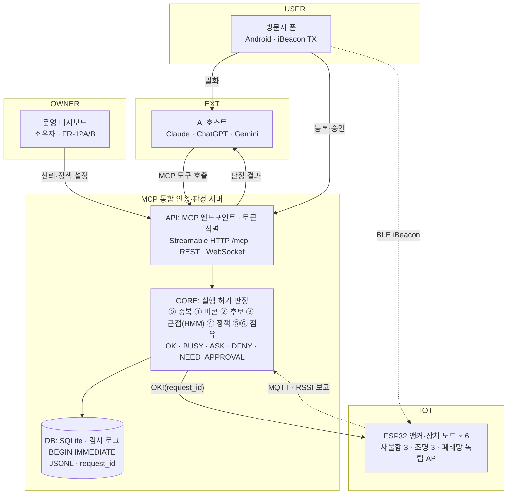
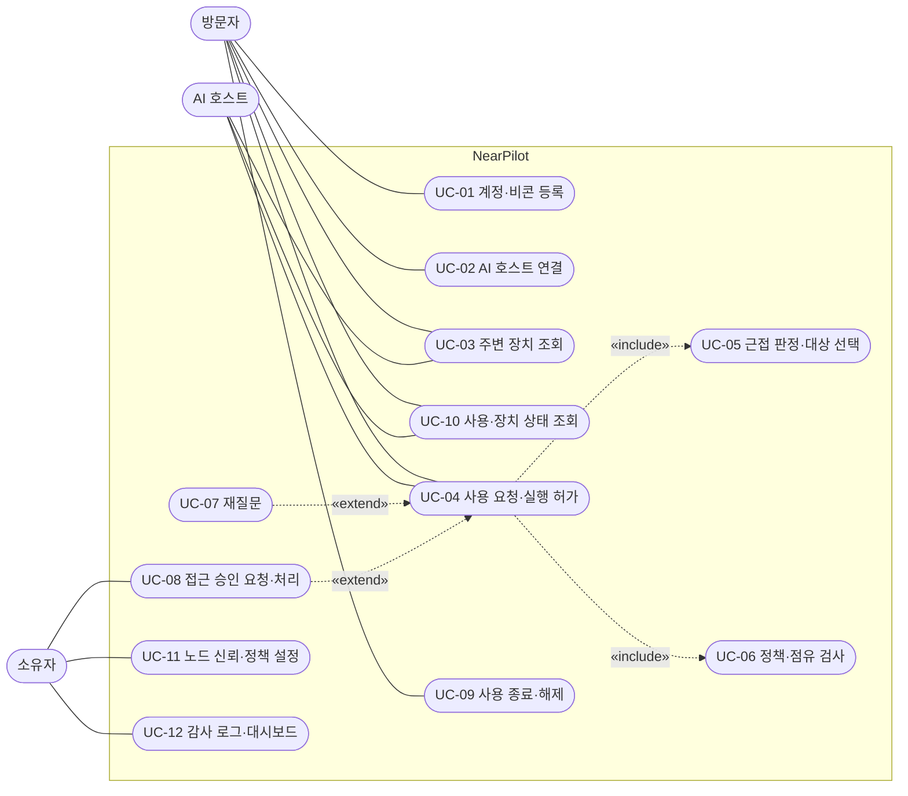
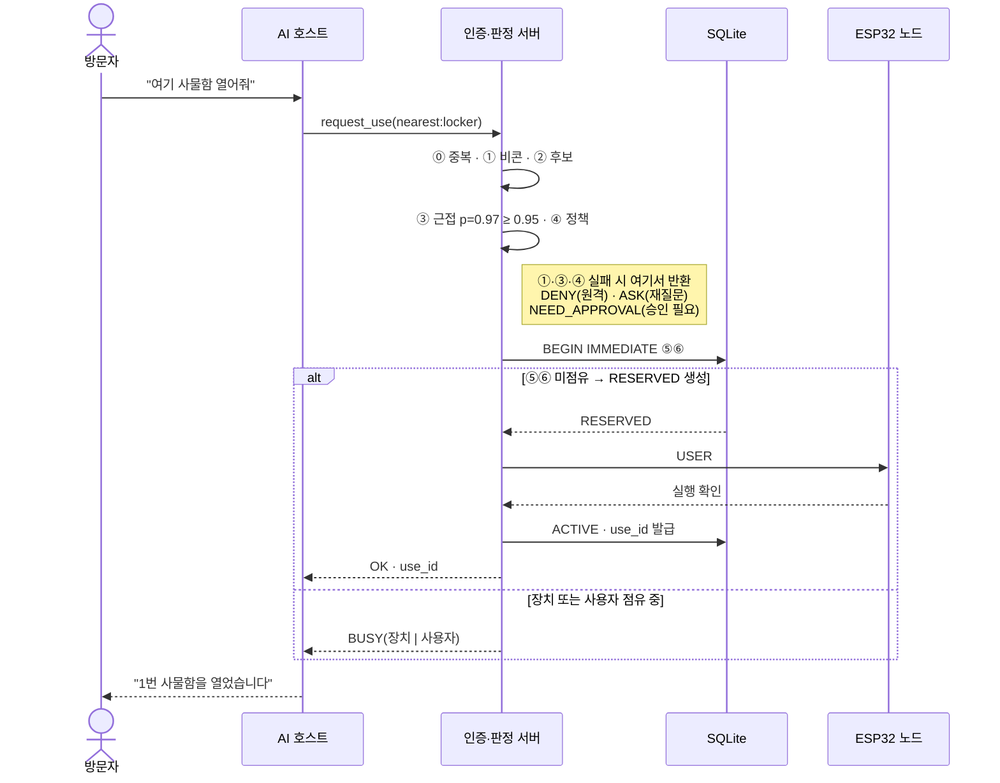
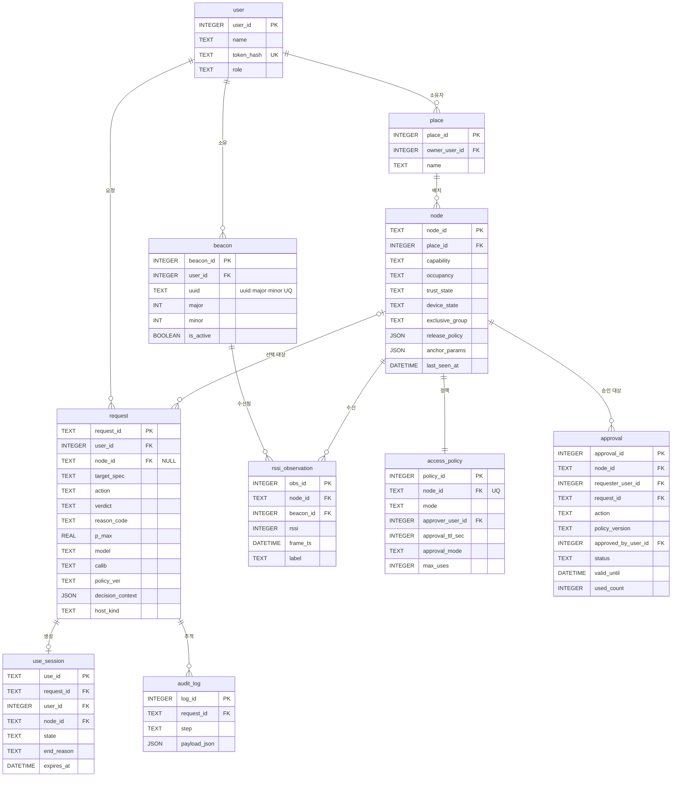
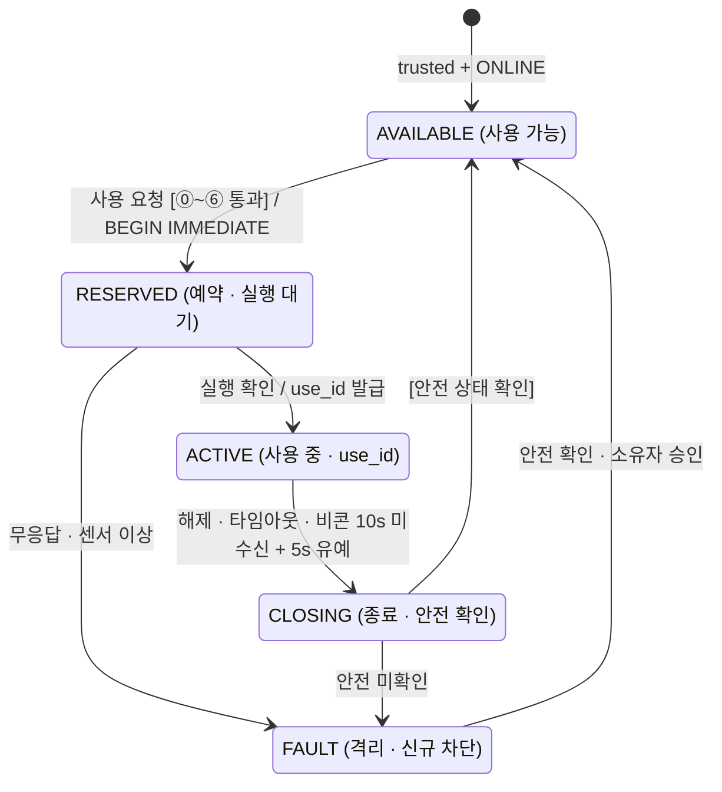

# NearPilot 요구사항 분석서

> 여러 AI 호스트에 MCP를 직접 제공하는 근접 판정·인증 서버

| 항목 | 내용 |
|---|---|
| 과목 | 2026학년도 2학기 캡스톤디자인 · 요구사항 분석서 |
| 조 · 팀명 | 6조 · 잇다 |
| 팀원 | 황재무(팀장) · 송우민 · 이은지 · 이예은 |
| 담당 교수 | 한동일, 임태진 |
| 제출일 | 2026-09-17 |
| 소속 | 세종대학교 컴퓨터공학과 |

## 목차

1. 프로젝트 개요
2. 문제 설명서와 액터
3. 시스템 구성도
4. 기능적 요구사항
5. 비기능적 요구사항
6. 유스케이스 목록과 다이어그램
7. 핵심 유스케이스 시나리오 (UC-04)
8. 시퀀스 다이어그램 (UC-04)
9. ERD
- 부록: A. 데이터 사전 · B. 상태 다이어그램 · C. 기타 유스케이스 · D. 인수 조건

핵심 기능 하나를 **요청 실행 허가(OK/BUSY 판정)** 로 정하고, 4·5장의 요구사항을 먼저 확정한 뒤 6~9장의 모델을 그 위에 세웠다.

---

## 1. 프로젝트 개요 — 무엇을, 왜 만드는가

### 배경

AI 호스트가 도구를 쓰는 방식은 MCP로 표준화되고 있지만, 물리 기기는 아직 장소마다 전용 앱과 가입을 요구한다. BLE 비콘 근접 제어는 고정 RSSI 임계값에 기대고, 사용자 여러 명과 같은 종류의 기기가 섞이면 요청을 배정할 계층이 없다.

### 현재 문제

- **플랫폼·장소 종속** — 잠깐 머무는 장소의 기기는 사실상 못 쓴다.
- **다중 사용자 간섭** — 내 요청이 남의 기기에 적용된다.
- **근접 판정 근거 부재** — LLM은 "어느 불인지" 모르고 RSSI 임계값은 환경이 바뀌면 틀린다.
- **호스트 신뢰 가정** — 허가를 호스트 확인 UI에 맡기지만 물리 동작은 되돌릴 수 없다.

### 목표

Claude·ChatGPT·Gemini가 **같은 MCP 도구**로 주변 기기를 요청하고, 서버가 계정·근처 비콘·접근 정책·점유 상태로 **실행 허가(OK/BUSY)** 를 판정한다. 방문자는 장소를 등록하지 않아도 되고, "어느 장치 앞인가"는 학습한 모델로 추정하며 모호하면 되묻는다.

### 물리 동작이 통과해야 하는 5조건

1. 토큰 계정과 근처에서 수신된 비콘이 같은 사용자
2. 신뢰·온라인·요청 종류가 맞는 장치만 근접 판정 후보
3. 근접 판정으로 물리적 대상을 먼저 확정한 뒤 정책·점유 검사
4. 실행 직전 OK/BUSY·근접·대상 재검사
5. 배타적 장치의 점유·해제는 서버가 원자적으로 관리

### 기대 효과

운영자는 노드를 한 번 신뢰 설정하면 전용 앱 없이 장치를 제공하고, 이용자는 장소마다 앱을 설치하지 않는다. 판정과 점유 기록이 감사 로그로 남는다.

### 범위 제외

실제 잠금장치·고보안 출입문·게이트 구현, iOS, 강한 단말 인증, 서버 판정에 LLM 사용. 고정 iBeacon은 복제 방지용 강한 인증 수단이 아님.

---

## 2. 문제 설명서 — 업무 절차 기술서와 액터

### 업무 절차

사용자는 앱에서 계정과 폰의 비콘 식별자를 **한 번** 등록하고, 쓰던 AI 호스트에 인증·판정 서버가 직접 제공하는 NearPilot MCP 엔드포인트를 연결한다. 폰은 iBeacon을 송출한다.

장소 **소유자**는 ESP32 노드를 설치해 신뢰 설정한다. 신뢰된 노드는 켜지면 자신의 기능(사물함·조명)을 발표해 자동 발견되고, 소유자는 장치마다 **개방** 또는 **제한(승인 필요)** 정책을 둔다.

**방문자**가 "여기 사물함 열어줘"라고 말하면 호스트가 MCP 도구를 호출한다. 인증 서버는 ① 등록 비콘 수신 여부 ② 신뢰·온라인·종류가 맞는 장치 후보 ③ 근접 추정 대상 ④ 대상의 접근 정책 ⑤⑥ 장치와 사용자의 점유 상태를 차례로 검사해 **OK / BUSY / 승인 필요 / 재질문** 중 하나를 낸다. OK일 때만 장치가 동작한다.

사용 종료는 장치별 해제 정책을 따른다. 대여형 사물함은 종료 발화·타임아웃·연속 비콘 미수신과 유예시간 만료 시 CLOSING으로 들어가며, 공용형 조명은 CLOSING 없이 선택적으로 자동 꺼진다. 안전 상태가 확인된 뒤에만 다음 사용자에게 OK를 주고 모든 판정은 감사 로그에 남긴다.

### 액터

| 액터 | 설명 |
|---|---|
| **방문자** | 계정·비콘을 등록한 사용자. 처음 온 장소에서 자기 AI 호스트로 장치를 조회하고 사용을 요청한다. |
| **소유자 / 설치자** | 노드를 설치·신뢰 설정하고 접근 정책을 정한다. 제한 장치의 승인 요청을 처리하고 로그를 본다. |
| **AI 호스트 (외부 시스템)** | Claude·ChatGPT·Gemini. 발화를 MCP 도구 호출로 바꾸고 결과를 사용자에게 전한다. 허가 판정에는 관여하지 않는다. |

ESP32 노드와 Android 앱은 시스템 내부 구성 요소로 본다.

---

## 3. 시스템 구성도 — 구성 요소와 메시지 흐름

인증·판정 서버가 MCP를 직접 제공한다.

| 흐름 | 방식 |
|---|---|
| 방문자 → AI 호스트 | 발화 |
| AI 호스트 ↔ 서버 | MCP 도구 호출 / 판정 결과 (MCP/HTTPS) |
| 앱 → 서버 | 등록·승인 |
| 대시보드 → 서버 | 신뢰·정책 설정 |
| 폰 → 노드 | BLE iBeacon |
| 노드 → 서버 | MQTT · RSSI 보고 (비동기 보고) |
| 서버 → 노드 | OK!(request_id) (실행 허가) |

---

## 4. 기능적 요구사항

- 우선순위: **필수** = 시연에 반드시 포함 · **우선** = 일정 여유 시
- 지표 번호는 부록 D의 정량 지표 1~9

### 4.1 앱 · 노드 · MCP 통합 서버 · 대시보드

#### Android 앱

| ID | 요구사항 | 설명 | 우선순위 | 지표 |
|---|---|---|---|---|
| FR-01 | 계정·비콘 1회 연결 | 계정을 만들고 폰의 iBeacon 식별자를 한 번 등록한다. 장소별 등록은 없다. | 필수 | 5 |
| FR-02 | 비콘 백그라운드 송출 | 등록한 식별자로 iBeacon을 계속 송출하고 송출 상태를 표시한다. | 필수 | 4·7 |
| FR-03 | 소유자 승인 UI | 제한 장치의 승인 요청을 받아 승인·거부하면 서버에 즉시 반영된다. | 필수 | 5 |

#### ESP32 앵커·장치 노드

| ID | 요구사항 | 설명 | 우선순위 | 지표 |
|---|---|---|---|---|
| FR-04 | 기능 발표(발견) | 부팅 시 capability와 점유 방식을 MQTT로 발표해 서버에 발견된다. | 필수 | 5 |
| FR-05 | iBeacon 스캔·RSSI 보고 | 주변 비콘을 약 1초 간격으로 스캔해 (식별자, RSSI)를 서버에 보고한다. | 필수 | 8 |
| FR-06 | 서버 허가 후 실행 | 서버의 "OK!(request_id)"를 받은 경우에만 액추에이터를 구동한다. | 필수 | 3·5 |
| FR-07 | 실행·안전 상태 보고 | 노드는 실행 결과와 장치별 안전 상태를 보고한다. 결과가 불명확하거나 안전 상태를 확인할 수 없으면 FAULT로 전환해 신규 요청을 차단한다. | 필수 | 6 |

#### 인증·판정 서버의 MCP 제공 · 호스트 통합

| ID | 요구사항 | 설명 | 우선순위 | 지표 |
|---|---|---|---|---|
| FR-08 | 통합 MCP 엔드포인트 | 인증·판정 서버가 Streamable HTTP MCP 엔드포인트를 직접 제공하고 같은 프로세스에서 토큰 식별과 실행 허가 판정을 처리한다. 토큰 없는 호출은 거부한다. | 필수 | 7 |
| FR-09 | MCP 도구 6개 | 장치 조회, 상태 조회, 접근 요청, 사용 요청, 해제, 사용 상태 조회. | 필수 | 7 |
| FR-10 | 3종 호스트 동일 동작 | Claude·ChatGPT·Gemini에서 같은 URL·도구로 같은 판정과 결과를 낸다. | 필수 | 7 |
| FR-11 | 후보만 반환 | 근접·신뢰·온라인 조건을 만족한 장치를 정책에 따라 '조작 가능'과 '승인 필요'로 나눠 반환한다. 비공개 장치와 점유 사용자 ID는 노출하지 않는다. | 필수 | 1·5 |

#### 운영 대시보드

| ID | 요구사항 | 설명 | 우선순위 | 지표 |
|---|---|---|---|---|
| FR-12A | 필수 관리 기능 | 소유자가 노드 신뢰·장소 배치·정책 설정·FAULT 복구를 수행하고 현재 장치 상태를 확인한다. | 필수 | 5·6 |
| FR-12B | 실시간 모니터링 | 판정 결과, 장치별 사후확률, 상태 머신과 감사 로그를 WebSocket으로 시각화한다. | 우선 | — |

### 4.2 MCP 통합 인증·판정 서버

MCP 제공 · 인증 · 발견 · 정책 · 판정 · 점유 · 기록

#### 장치 발견 · 접근 정책

| ID | 요구사항 | 설명 | 우선순위 | 지표 |
|---|---|---|---|---|
| FR-13 | 노드 신뢰·온라인 판정 | 소유자가 발견 노드를 신뢰 설정하고 장소에 배치한다. 신뢰 여부와 온라인 여부를 분리하며, 신뢰되고 최근 보고가 있는 온라인 노드만 후보가 된다. | 필수 | 5 |
| FR-14 | 장치별 승인 정책 | 승인은 요청자·장치·동작·정책 버전에 묶는다. 사물함은 기본 1회, 조명은 유효시간 내 반복 허용하며 장치별 횟수·유효시간을 설정한다. | 필수 | 5 |

#### 실행 허가 판정 — 핵심 기능 (UC-04)

| ID | 요구사항 | 설명 | 우선순위 | 지표 |
|---|---|---|---|---|
| FR-15 | 계정–비콘 대조 | 토큰 계정의 비콘이 장소 앵커에서 최근 T초 안에 수신됐을 때만 판정을 시작한다. 원격 호출은 거부한다. | 필수 | 5·7 |
| FR-16 | 근접 추정·대상 선택 | 앵커별 RSSI에 관측 모델과 HMM 필터를 적용해 "어느 장치 앞인가"의 사후확률을 구하고 최대 장치를 고른다. | 필수 | 1·2·8 |
| FR-17 | 비용 기반 재질문 | 사후확률이 임계값(사물함 0.95, 조명 0.75) 미만이면 실행하지 않고 후보를 되묻는다. | 필수 | 2 |
| FR-18 | 결정론적 OK/BUSY | ⓪ 중복 → ① 비콘 → ② 신뢰·온라인·종류 후보 → ③ 근접 대상 → ④ 정책 → ⑤ 장치 점유 → ⑥ 사용자 점유 순으로 검사한다. 기본값은 거부. | 필수 | 3·4·5 |

#### 점유 · 해제 · 기록

| ID | 요구사항 | 설명 | 우선순위 | 지표 |
|---|---|---|---|---|
| FR-19 | 원자적 점유·상태 머신 | 대여형은 AVAILABLE→RESERVED→ACTIVE→CLOSING. SQLite 단일 쓰기 경로의 BEGIN IMMEDIATE 트랜잭션에서 ⑤⑥ 검사와 RESERVED 생성을 함께 처리한다. | 필수 | 3·6 |
| FR-20 | 장치별 종료·해제 | release_policy가 종료 조건을 정한다. 사물함은 명시 해제·타임아웃·비콘 10초 미수신 후 5초 유예 시 CLOSING, 조명은 CLOSING 없이 선택적 자동 꺼짐. | 필수 | 6 |
| FR-21 | 핸들 소유권 | 해제·상태 조회는 use_id가 호출 계정의 것일 때만 처리한다. | 필수 | 5 |
| FR-22 | 감사 로그 | 요청·판정·실행·복구와 함께 모델·보정·정책 버전, 임계값, 후보별 확률, 사용 관측 구간을 JSONL로 남겨 request_id로 재현한다. | 필수 | 3·5·7 |
| FR-23 | 전역 할당 | 500ms 내 "빈 사물함 아무거나" 요청을 묶고, 허용쌍의 비용 −log(근접확률) 합이 최소가 되도록 1:1 배정한다. 동률은 ID순으로 결정하며 미배정은 ASK/BUSY로 반환한다. | 필수 | 9 |

---

## 5. 비기능적 요구사항 — 성능 · 신뢰성 · 보안 · 인터페이스 · 제약

| ID | 분류 | 요구사항 | 목표치 | 지표 |
|---|---|---|---|---|
| NFR-01 | 성능 | 응답 시간 | 서버 판정은 요청 수신부터 결과 반환까지 median 1초·p95 2초 이하. 발화부터 안내까지 종단 시간은 median 3초·p95 6초 이하로 별도 측정 | 7 |
| NFR-02 | 성능 | 근접 추정 반응 | 이동 후 대상 전환 2초 이내, 정지 시 깜빡임 80% 감소 | 8 |
| NFR-03 | 신뢰성 | 점유 원자성 | 단일 판정 쓰기 경로와 SQLite BEGIN IMMEDIATE를 사용한다. 동시 요청 2,000회·재전송 100회에서 이중 점유 0건, 물리 실행 1회 이하 | 3 |
| NFR-04 | 신뢰성 | 고장 격리·복구 | FAULT 장치는 후보에서 제외한다. 점유 또는 안전 상태가 불명확하면 세션을 보존하고, 장치별 안전 조건 확인·상태 동기화·소유자 승인 후에만 복구한다. | 6 |
| NFR-05 | 정확성 | 대상 오선택 | 타 장치 동작 2.5% 이하. 3명 동시 요청에서 타 사용자 기기 오동작 0건 | 1·4 |
| NFR-06 | 정확성 | 근접 모델 품질 | 정면 오선택률 5% 이하, ECE 0.05 이하, 오작동–재질문 곡선에서 오작동 0건 | 2·8 |
| NFR-07 | 보안 | 서버 측 인가 | 허가는 서버가 결정. 비콘 없는 토큰·타인 핸들·미신뢰 노드·유도된 타 장치 호출을 거부하고 로그로 공개 | 5 |
| NFR-08 | 보안 | 정보 최소화·통신 | 사용자 ID를 LLM에 노출하지 않음. 호스트↔MCP는 HTTPS+토큰, 서버↔노드는 폐쇄망·노드별 자격정보 | 7 |
| NFR-09 | 호환성 | 호스트 동등성 | 3종 호스트에서 같은 발화의 판정·결과 일치 98% 이상. 호스트 교체 시 서버 변경 없음 | 7 |
| NFR-10 | 하드웨어 | 노드·액추에이터 | ESP32 + NimBLE, 저전압 서보 사물함 3(리드 스위치), LED 조명 3, 앵커 6개, 유효 반경 약 0.5 m | — |
| NFR-11 | 인터페이스 | 통신 규격 | MCP Streamable HTTP, MQTT, BLE iBeacon, WebSocket, HTTPS REST | 7 |
| NFR-12 | 가용성 | 네트워크 독립 | 행사장 Wi-Fi 없이 독립 AP·핫스팟으로 동작한다. 앱은 송출 중단을 감지하고 서버는 일시 유실과 이탈을 연속 미수신·유예시간으로 구분한다. | — |
| NFR-13 | 유지보수 | 재현·자동 평가 | 로그에 모델·보정·정책 버전과 판정 입력을 보존해 같은 버전으로 재현한다. 평가 표·그래프는 스크립트 생성, pytest 회귀 | 8 |
| NFR-14 | 제약 | 범위·보안 가정 | Android·모형 사물함·조명만 구현하며 게이트는 확장 항목이다. 고정 iBeacon은 복제 방지용 강한 인증이 아니며 판정에 LLM을 쓰지 않는다. | — |

---

## 6. 유스케이스 — 식별자 목록과 다이어그램

핵심: **UC-04 장치 사용 요청·실행 허가**

| ID | 행위자 | 유스케이스 |
|---|---|---|
| UC-01 | 방문자·소유자 | 계정·비콘 등록 |
| UC-02 | 방문자 | AI 호스트 연결 |
| UC-03 | 방문자·호스트 | 주변 장치 조회 |
| **UC-04** | **방문자·호스트** | **장치 사용 요청·실행 허가 (OK/BUSY)** |
| UC-05 | include | 근접 판정·대상 선택 |
| UC-06 | include | 정책·점유 검사 |
| UC-07 | extend | 재질문 (사후확률이 임계값 미만) |
| UC-08 | 방문자·소유자 | 접근 승인 요청·처리 |
| UC-09 | 방문자 | 사용 종료·해제 |
| UC-10 | 방문자·호스트 | 사용·장치 상태 조회 |
| UC-11 | 소유자 | 노드 신뢰·정책 설정 |
| UC-12 | 소유자 | 감사 로그·대시보드 |

include는 항상 수행되는 하위 흐름, extend는 조건이 맞을 때만 붙는 흐름. 등록·연결은 사전 조건으로만 다룬다.

---

## 7. 핵심 유스케이스 시나리오 — UC-04 장치 사용 요청·실행 허가

> "여기 사물함 열어줘"

| 항목 | 내용 |
|---|---|
| 행위자 | 방문자(주), AI 호스트(보조) · include UC-05·06 · extend UC-07·08 |
| 사전 조건 | 계정·비콘 등록, 호스트 연결, 앱이 비콘 송출 중, 장소 노드가 사용 가능 상태 |
| 사후 조건 | **OK**: 장치 실행, 대여형은 점유되고 use_id 발급. **그 외**: 상태 변화 없음. 모두 감사 로그 기록 |

### 기본 흐름

1. 방문자가 호스트에 "여기 사물함 열어줘"라고 말한다.
2. 호스트가 `request_use(nearest:locker, open, request_id)`를 호출한다.
3. 인증·판정 서버가 MCP 요청을 직접 받고 토큰으로 계정을 확인한다.
4. ⓪ 처리된 request_id가 아님을 확인한다.
5. ① 계정의 비콘이 장소 앵커에서 최근 T초 안에 수신됐는지 확인한다.
6. ② 신뢰·온라인·요청 종류가 맞는 장치를 근접 판정 후보로 만든다.
7. ③ [UC-05] 관측 모델+HMM으로 p(사물함 1)=0.97 ≥ 0.95 → 물리적 대상 확정.
8. ④ [UC-06] 선택된 대상의 접근 정책을 검사한다.
9. ⑤⑥ [UC-06] 장치 미점유·사용자 미점유를 단일 트랜잭션에서 확인하고 RESERVED로 바꾼다.
10. 노드에 "USER#n OK!"를 보내고 서보가 열린다.
11. 실행 확인을 받아 ACTIVE로 바꾸고 use_id를 발급한다.
12. 호스트가 "1번 사물함을 열었습니다"라고 안내한다.

### 대안 흐름

- **A1 명시적 대상** "1번 사물함" — 지정 장치에서도 근접 확률을 계산하며, 임계값 미만이면 가까이 이동하도록 안내하고 실행하지 않는다.
- **A2 재질문 [UC-07]** — 사후확률이 임계값 미만이면 후보를 되묻고, 답을 받아 A1로 재요청.
- **A3 승인 필요 [UC-08]** — 제한 장치는 요청자·장치·동작·정책 버전에 맞는 승인을 확인한다. 1회 승인은 실행 후 소진하고 기간 승인은 만료 전까지 허용한다.
- **A4 공용형 장치** — 조명은 점유 없이 ⑤⑥을 건너뛰고 일회성 상태 변경.
- **A5 전역 할당** — 같은 500ms 구간의 "빈 사물함 아무거나" 요청을 모아 FR-23의 1:1 최소 비용 배정을 수행.

### 예외 흐름

- **E1 비콘 미수신** — 거부(원격 요청). 장치 목록도 주지 않는다.
- **E2 장치 점유 중** — BUSY(장치).
- **E3 사용자 점유 중** — 이미 다른 사물함을 점유 → BUSY(사용자).
- **E4 중복 요청** — 같은 request_id는 기존 결과를 반환, 물리 실행 1회 이하.
- **E5 실행 실패** — 노드 무응답·센서 이상 → FAULT 및 후보 제외. 상태가 불명확하면 점유를 보존하고 안전 확인·상태 동기화·소유자 승인 후 복구.
- **E6 토큰 무효** — 인증·판정 서버가 MCP 요청 단계에서 거부.

판정 ⓪~⑥은 결정론이며 기본값은 거부다. 사용자 ID는 호스트에 전달되지 않는다 (FR-18, FR-19).

---

## 8. 시퀀스 다이어그램 — UC-04 기본 흐름과 분기

OK · BUSY · 재질문 · 거부

---

## 9. 데이터 요구사항 — ERD

MCP 통합 인증·판정 서버 SQLite · 10개 테이블

> 선은 핵심 관계만 표시했다. use_session · approval의 user·node 참조와 approval의 request 참조는 FK 필드로 표기.

---

## 부록 A. 데이터 사전

### user (계정)

| 필드 | 타입 | 설명 |
|---|---|---|
| user_id | INTEGER PK | 계정 ID. LLM 입력에 노출하지 않음 |
| name | TEXT | 표시 이름 |
| token_hash | TEXT UNIQUE | MCP 호출 토큰의 해시 |
| role | TEXT | visitor / owner |

### beacon (비콘 식별자)

| 필드 | 타입 | 설명 |
|---|---|---|
| beacon_id | INTEGER PK | 비콘 레코드 ID |
| user_id | FK → user | 소유 계정 |
| uuid / major / minor | TEXT / INT / INT | iBeacon 식별자, 조합 UNIQUE |
| is_active | BOOLEAN | 현재 사용 여부 |

### place (장소)

| 필드 | 타입 | 설명 |
|---|---|---|
| place_id | INTEGER PK | 장소 ID |
| owner_user_id | FK → user | 설치자·소유자 |
| name | TEXT | 공용 라운지 / 친구 집 |

### access_policy (접근 정책)

| 필드 | 타입 | 설명 |
|---|---|---|
| policy_id | INTEGER PK | 정책 ID |
| node_id | FK → node, UNIQUE | 대상 노드 (노드당 1개) |
| mode | TEXT | open(개방) / restricted(제한) |
| approver_user_id | FK → user | 승인 권한 계정 |
| approval_ttl_sec | INTEGER | 승인 유효 시간 |
| approval_mode | TEXT | one_time / time_window |
| max_uses | INTEGER, NULL | 허용 횟수. 기간형 무제한이면 NULL |

### node (장치 노드)

| 필드 | 타입 | 설명 |
|---|---|---|
| node_id | TEXT PK | locker-1, light-2 등 |
| place_id | FK → place | 신뢰 설정 시 배치된 장소 |
| capability | TEXT | locker / light · gate는 향후 확장 예약값 |
| occupancy | TEXT | rental(대여) / shared(공용) · pass는 향후 확장 |
| trust_state | TEXT | discovered / trusted / revoked |
| online_state | DERIVED | last_seen_at과 TTL로 ONLINE / OFFLINE 계산 |
| device_state | TEXT | AVAILABLE / RESERVED / ACTIVE / CLOSING / FAULT |
| exclusive_group | TEXT | 사용자당 1대인 배타 그룹 |
| release_policy | JSON | 종료 조건, 이탈 동작, 미수신·유예 시간 |
| anchor_params | JSON | 경로손실 모델 파라미터 A, n, σ |
| last_seen_at | DATETIME | 최근 온라인 시각 |

### approval (승인 요청)

| 필드 | 타입 | 설명 |
|---|---|---|
| approval_id | INTEGER PK | 승인 요청 ID |
| node_id | FK → node | 제한 장치 |
| requester_user_id | FK → user | 요청한 방문자 |
| request_id / action | FK / TEXT | 승인 대상 요청과 동작 |
| policy_version | TEXT | 승인 당시 접근 정책 버전 |
| approved_by_user_id | FK → user | 실제 승인한 소유자 |
| status | TEXT | pending / approved / denied |
| valid_until | DATETIME | 승인 유효 기한 |
| used_count | INTEGER | 사용 횟수. one_time은 1회 후 소진 |

### rssi_observation (관측)

| 필드 | 타입 | 설명 |
|---|---|---|
| obs_id | INTEGER PK | 관측 레코드 |
| node_id | FK → node | 수신한 앵커 |
| beacon_id | FK → beacon | 수신된 비콘 |
| rssi / frame_ts | INTEGER / DATETIME | dBm 값과 약 1초 프레임 시각 |
| label | TEXT, NULL | 수집 모드 라벨 (장치 1~6 앞, none) |

### request (요청·판정)

| 필드 | 타입 | 설명 |
|---|---|---|
| request_id | TEXT PK | 호스트가 만든 멱등 키. 중복이면 기존 결과 반환 |
| user_id | FK → user | 토큰으로 식별된 계정 |
| node_id | FK → node, NULL | 최종 선택 장치. 재질문·거부면 NULL |
| target_spec / action | TEXT | nearest:locker 또는 locker-1 / open, on, off |
| verdict | TEXT | OK / BUSY / ASK / DENY / NEED_APPROVAL |
| reason_code / p_max | TEXT / REAL | 사유 코드와 사후확률 최댓값 |
| model / calib / policy_ver | TEXT | 재현에 사용한 모델·보정·정책 버전 |
| decision_context | JSON | 임계값·후보별 확률·사용 관측 구간 |
| host_kind | TEXT | claude / chatgpt / gemini (동등성 평가) |

### use_session (점유)

| 필드 | 타입 | 설명 |
|---|---|---|
| use_id | TEXT PK | 대여형 핸들. 계정·장치·만료에 묶임 |
| request_id | FK → request | 생성한 요청 |
| user_id / node_id | FK | 점유 주체와 장치 |
| state | TEXT | RESERVED / ACTIVE / CLOSING / CLOSED |
| end_reason | TEXT | release / leave / timeout / fault |
| expires_at | DATETIME | 타임아웃 기준 시각 |

### audit_log (감사 로그)

| 필드 | 타입 | 설명 |
|---|---|---|
| log_id | INTEGER PK | 로그 ID (JSONL 파일과 병행) |
| request_id | FK → request | 추적 키 |
| step | TEXT | ⓪~⑥ 판정 단계 / exec / close / fault |
| payload_json | JSON | 단계별 입력·결과·사유와 버전·임계값·후보 확률·관측 참조 |

> 관측·로그는 평가 후 계정 ID를 제거해 공개용 데이터셋으로 보존하고, 토큰 해시와 비콘 식별자는 프로젝트 종료 시 폐기한다.

---

## 부록 B. 상태 다이어그램 — 사물함(대여형) 상태 머신

관련 요구사항: FR-19 · FR-20. 전이 표기 — `이벤트 [가드] / 동작`

`* → FAULT`: 어느 상태에서든 이상 감지 시 격리, 불명확한 점유는 보존.

### 점유 방식별 차이

| 방식 | 장치 | 규칙 |
|---|---|---|
| **대여형** | 사물함 | 명시 해제·타임아웃·이탈 유예 만료 시 CLOSING |
| **통과형** | 게이트 | 향후 확장. 동작 중에만 점유하며 CLOSING 없음 |
| **공용형** | 조명 | 점유·CLOSING 없음. 이탈 시 정책에 따라 자동 꺼짐 |

### 노드 후보 조건

| 구분 | 의미 |
|---|---|
| trust_state | discovered / trusted / revoked |
| online_state | last_seen_at 기준 ONLINE / OFFLINE |
| 후보 조건 | trusted + ONLINE + 장치 상태·종류 조건 충족 |

**범용 복구:** 이상 감지 → FAULT 격리 → 신규 요청 차단 → 장치별 안전 조건 확인 → 서버·물리 상태 동기화 → 소유자 승인 → AVAILABLE 복귀. 불명확한 점유는 복구 전까지 보존하고 전 과정을 감사 로그에 남긴다.

---

## 부록 C. 기타 유스케이스 — UC-01 · 03 · 08 · 09 · 10 · 11 요약

| 유스케이스 | 사전 → 사후 | 기본 흐름 | 대안 · 예외 |
|---|---|---|---|
| UC-01 계정·비콘 등록 | 앱 설치 → 계정·비콘 생성, 토큰 발급 | 계정 생성 → 폰 비콘 식별자 등록 → 송출 시작 → MCP 연결용 토큰 표시 | E1 이미 다른 계정의 식별자 → 거부 |
| UC-03 주변 장치 조회 | 비콘 송출 중 → 변화 없음 | "여기 뭐 쓸 수 있어?" → find_available_devices → 근접·사용 가능·미점유 후보를 '조작 가능'과 '승인 필요'로 나눠 반환 | E1 비콘 미수신 → 빈 목록. 타 사용자 정보는 반환하지 않음 |
| UC-08 접근 승인 | 승인 필요 → 범위·기한이 있는 승인 | request_access → 소유자 앱 → 요청자·장치·동작 확인 → 1회/기간 승인 → UC-04 재요청 | A1 거부·만료·정책 변경 → 다시 승인. E1 횟수 초과·다른 동작 → 거부 |
| UC-09 사용 종료·해제 | 점유 ACTIVE → CLOSED, 장치 AVAILABLE | "다 썼어" → 소유권 확인 → 장치 release_policy 평가 → 필요 시 CLOSING → 안전 상태 확인 → AVAILABLE | A1 사물함은 10초 미수신+5초 유예 또는 타임아웃으로 자동. A2 조명은 선택적 자동 꺼짐. E1 타인 use_id 거부. E2 안전 미확인 → FAULT |
| UC-10 상태 조회 | 유효 토큰 → 변화 없음 | get_use_status / get_device_state → 근접 검사 없이 상태 반환 | E1 타인·만료 핸들 → 거부. 점유 주체는 노출하지 않음 |
| UC-11 노드 신뢰·정책 | 노드 discovered → trusted | 필수 관리 화면에서 발견 노드 확인 → 장소 배치·신뢰 설정 → 개방/제한과 승인자 지정 | E1 미신뢰·오프라인 노드가 후보에 등장 0건. A1 정책 변경은 진행 중 점유에 소급하지 않음 |

UC-02(호스트 연결)는 호스트별 절차를 따르며, 1~2주차에 tools/list와 무해한 도구 호출이 되는지로 검증한다. UC-05·06·07은 UC-04 시나리오에 포함했고, UC-12는 FR-12A·12B로 대신한다.

---

## 부록 D. 인수 조건 — 정량 지표 9개와 요구사항 대응

| # | 지표 | 측정 방법 | 목표치 | 요구사항 |
|---|---|---|---|---|
| 1 | 오선택률 | 동일 발화 100건 | 타 장치 동작 2.5% 이하 | FR-11·16, NFR-05 |
| 2 | 오작동–재질문 곡선 | 6개 위치 × 30회, 비용 비율별 | 같은 재질문률에서 오작동 낮음, 오작동 0건 | FR-17, NFR-06 |
| 3 | 점유 원자성 | 동시 클라이언트 요청 2,000회, 재전송 100회 | SQLite 잠금 오류 처리 후 이중 점유 0건, 물리 실행 1회 이하 | FR-18·19, NFR-03 |
| 4 | 다중 사용자 간섭 | 3명 동시 50회씩 | 타 사용자 기기 오동작 0건, 요청 기기 동작 95% 이상 | FR-15·18, NFR-05 |
| 5 | 정책·발견·차단 | 미등록·무권한·1회 승인·기간 승인·타인 핸들·미신뢰 각 30회 | 범위 밖 조작 0건, 유효 승인 성공 95% 이상, 미신뢰 후보 0건 | FR-13·14·15·21, NFR-07 |
| 6 | 종료·복구 처리 | 장치별 명시 해제·이탈 유예·타임아웃·센서 장애 각 30회 | 정책과 다른 CLOSING 0건, 안전 미확인 다음 OK 0건, 복구 성공 95% 이상 | FR-07·20, NFR-04 |
| 7 | 지연·호스트 동등성 | 서버 판정 100회, 호스트별 동일 발화 50건 | 서버 median 1초·p95 2초, 종단 median 3초·p95 6초, 판정 일치 98% 이상 | FR-08·10, NFR-01·08·09 |
| 8 | 근접 추정 모델 | 위치별 독립 수집 회차 5회 이상, 회차 단위 60/20/20 분리, 단계별 ablation | 검증셋으로 임계값 확정 후 시험셋 고정 평가. 정면 오선택 5% 이하, 10구간 ECE 0.05 이하, 전환 2초 이내 | FR-16, NFR-02·06 |
| 9 | 전역 할당 | 3명·사물함 3대의 위치·점유 조합 50세트 | 중복 배정 0건, 허용쌍만 배정, 기준 최적 비용과 100% 일치 | FR-23 |

### 기능 시험

대표 시연 4장면(세 기기 분리, 두 종류의 BUSY, 자동 해제 후 재사용, 호스트 교체)을 50회 리허설해 성공률과 실패 원인을 공개한다. FR마다 pytest 케이스를 둔다.

### 성능 시험

같은 회차의 RSSI 프레임은 서로 다른 데이터 분할에 섞지 않는다. 임계값은 검증셋에서만 고르고 시험셋 확인 전 고정한다. 지표 3은 부하 스크립트, 9는 기준 최적해와 비교하며 "0건"에는 95% 신뢰구간 상한을 적는다.
