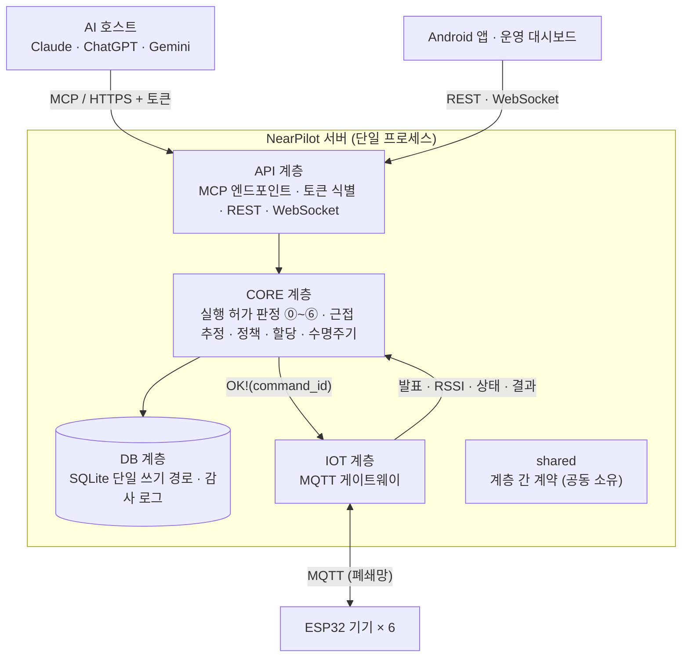
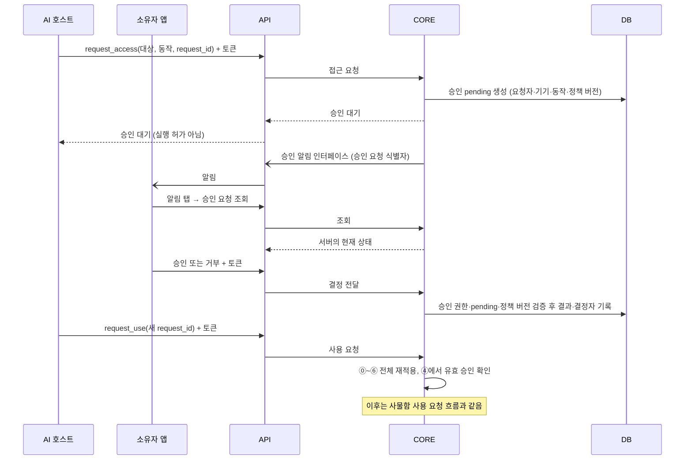

# 아키텍처

<!--
이 문서는 "영역은 어떻게 나뉘고 어떻게 연결되는가"에 답한다.
쓰는 것: 영역, 디렉터리, 담당, 의존 관계, 영역 간 계약, 외부 계약, 데이터 계약, 영역을 넘는 흐름, 기술 스택
쓰지 않는 것: 영역 내부 구조 (spec과 코드), 요구사항 (requirements.md)
계약 시그니처의 원본은 server/src/nearpilot/shared/ 코드다. 이 문서에는 제공 영역, 사용 영역, 약속만 쓴다.
-->

## 1. 구성

서버는 API, CORE, DB, IOT의 4계층으로 구성한다. 4인의 역할은 **판정, 근접 추정, 상태 관리, DB**다. 계층 구조와 사람의 역할 분담은 서로 다르다.



| 계층 | 책임 | 관련 요구사항 |
|---|---|---|
| **API** | MCP Streamable HTTP 엔드포인트와 도구 6개, 토큰으로 계정 식별, 앱과 대시보드용 REST, 실시간 모니터링 WebSocket, 소유자 앱 승인 알림 전달, 응답에서 사용자 ID 제거 | FR-08, FR-09, FR-10, FR-11. 서버 측: FR-01, FR-03, FR-12A, FR-12B. NFR-01, NFR-07, NFR-08, NFR-09, NFR-11 |
| **CORE** | ⓪~⑥ 결정론적 판정, 실행 직전 재검사, 근접 추정 (관측 모델과 HMM), 재질문, 접근 정책과 승인, 전역 할당, 상태 머신, 해제, `FAULT` 복구 | FR-13~FR-21, FR-23, NFR-02, NFR-04, NFR-05, NFR-06 |
| **DB** | SQLite 스키마, 단일 쓰기 경로와 `BEGIN IMMEDIATE` 원자적 점유, 저장소 조회, 감사 로그 (테이블과 JSONL), 공개용 데이터셋 추출 | FR-19 (원자성), FR-22, NFR-03, NFR-13 |
| **IOT** | MQTT 브로커 연결, 기기 발견, RSSI, 상태, 실행 결과의 수신과 검증, 실행 명령 전송과 결과 대기 (타임아웃), 기기별 자격정보, 기기 시뮬레이터 | 서버 측: FR-04~FR-07. NFR-08, NFR-10, NFR-12, 지표 8 수집 |
| **shared** | 계층 사이에서 오가는 데이터 모델, 열거형, 인터페이스의 정의. 4인이 공동으로 소유한다. | FR-09, FR-18, FR-19 |

## 2. 영역과 담당

### 디렉터리

```
nearpilot-server/
├── AGENTS.md                   에이전트 지침
├── CLAUDE.md                   AGENTS.md를 불러온다
├── docs/                       제품, 요구사항, 아키텍처, 문체와 용어
├── specs/                      작업 명세 specs/{계층}-{요약}/spec.md
│   └── _template/              spec 양식
├── .github/                    이슈 양식, PR 양식, CI
├── server/
│   ├── pyproject.toml
│   ├── src/nearpilot/
│   │   ├── shared/             계층 간 계약: 도메인 모델, 열거형, 인터페이스, 설정
│   │   ├── api/
│   │   │   ├── mcp/            MCP 엔드포인트와 도구 6개 (FR-08~FR-11)
│   │   │   ├── auth/           토큰으로 계정 식별, 무효 토큰 거부
│   │   │   ├── rest/           앱(계정, 승인)과 대시보드(신뢰, 정책, 복구)용 API
│   │   │   └── ws/             실시간 모니터링 (FR-12B)
│   │   ├── core/
│   │   │   ├── decision/       ⓪~⑥ 판정 파이프라인 (FR-15, FR-18)
│   │   │   ├── proximity/      관측 모델, HMM, 재질문 임계값 (FR-16, FR-17)
│   │   │   ├── policy/         접근 정책과 승인 검사 (FR-14)
│   │   │   ├── allocation/     전역 할당 (FR-23)
│   │   │   └── lifecycle/      상태 머신, 자동 해제, FAULT 복구 (FR-19, FR-20, NFR-04)
│   │   ├── db/
│   │   │   ├── schema/         DDL과 마이그레이션
│   │   │   ├── repositories/   테이블별 저장소와 원자적 점유
│   │   │   └── audit/          감사 로그 (FR-22)
│   │   └── iot/
│   │       ├── mqtt/           브로커 연결, 구독, 명령 전송
│   │       └── messages/       MQTT 페이로드 스키마 (펌웨어와의 계약)
│   ├── tests/
│   │   ├── api/ core/ db/ iot/ shared/    계층별 단위 테스트
│   │   └── integration/        계층을 합친 시나리오 테스트
│   └── tools/
│       ├── node_sim/           가상 ESP32 기기 (하드웨어 없이 개발과 부하 시험)
│       ├── data_collection/    RSSI 라벨 수집 (지표 8)
│       └── evaluation/         지표 1~9 평가 표와 그래프 생성 (NFR-13)
├── app/                        Android 앱 (비콘 송출, 알림)
├── dashboard/                  운영 대시보드 (웹)
└── firmware/                   ESP32 기기 펌웨어
```

### 담당

표의 경로는 `server/` 기준이다. 테스트는 `tests/` 아래 같은 이름의 폴더에 둔다.

| 역할 | 담당 폴더 | 책임 |
|---|---|---|
| **판정** | `src/nearpilot/core/decision/`, `core/allocation/`, `api/mcp/`, `api/auth/` | 판정 ⓪~⑥ 조합, 근접, 정책, 점유 결과의 반영, 실행 직전 재검사, 전역 할당, MCP 도구 6개, 토큰으로 계정 식별 |
| **근접 추정** | `src/nearpilot/core/proximity/`, `tools/data_collection/` | 관측 모델과 HMM, 사후확률 계산, 근접 추정 인터페이스, RSSI 라벨 수집 |
| **상태 관리** | `src/nearpilot/core/lifecycle/`, `iot/`, `tools/node_sim/` | 예약 뒤의 상태 전이, 이탈 유예, 타임아웃, 해제, `FAULT` 복구, MQTT 게이트웨이, 기기 시뮬레이터 |
| **DB** | `src/nearpilot/db/`, `core/policy/`, `tools/evaluation/` | 스키마, 저장소, 원자적 점유와 승인 사용분, 감사 로그, 평가 스크립트, 접근 정책과 승인 검사, 토큰 해시로 계정 조회 (`AccountLookup`) |
| **공동** | `src/nearpilot/shared/`, `tests/integration/` | 계층 간 계약, 계층을 합친 시나리오 테스트 |

- 이 표는 역할별 담당 범위를 기록한다. 개인 이름은 쓰지 않는다.
- 미결: `api/rest/`와 `api/ws/`의 담당. 앱과 대시보드의 담당을 정할 때 함께 배정한다.
- 미결: 앱(`app/`)과 대시보드(`dashboard/`)의 담당. 서버 담당 업무를 먼저 마친 사람이 맡는다.
- 미결: 펌웨어(`firmware/`)의 담당

## 3. 의존 관계

```
api  ──▶  core  ──▶  db
            │  ◀──  iot      (iot → core 는 이벤트 전달, core → iot 는 실행 명령)
모든 계층 ──▶ shared
```

의존 규칙은 `AGENTS.md` "코딩 규칙"에 있다.

## 4. 영역 간 계약

| 계약 | 제공 | 사용 | 약속 |
|---|---|---|---|
| 저장소 인터페이스 | DB | CORE (API는 계정 식별만) | 계정과 비콘, 기기, 정책 이력과 승인 사용분, 외부 키와 내부 요청 ID와 명령 ID의 연결, 점유 세션, RSSI 관측, 원자적 점유와 승인 예약 (`reserve_if_free`) |
| 감사 로그 인터페이스 | DB | CORE | 단계별 입력, 결과, 버전, 임계값, 후보 확률의 기록 |
| 기기 명령 인터페이스 | IOT | CORE | `command_id`별로 전송과 결과를 추적한다. 확실한 미전송, 전송 뒤 성공, 전송 뒤 실패, 결과 불명을 구분한다. 시간 초과와 연결 끊김을 미실행으로 보지 않는다. |
| 기기 이벤트 인터페이스 | CORE | IOT | CORE는 IOT가 전달한 기능 발표, RSSI 프레임, 안전 상태 보고를 받는다. |
| 기능 인터페이스 | CORE | API | MCP 도구 6개와 관리 기능 (계정 등록, 기기 신뢰, 정책, 승인, `FAULT` 복구) |
| 승인 알림 인터페이스 | API | CORE | 승인 대기가 생기면 CORE가 소유자 앱 알림을 요청한다. 요청에는 승인 요청 식별자를 담는다. 전달 실패는 승인 상태와 판정을 바꾸지 않는다. 전달 수단은 미결이다 (FR-03). |
| 도메인 모델·열거형 | 공동 | 전체 | 상태 값, 판정 결과 (`OK`, `BUSY`, `ASK`, `DENY`, `NEED_APPROVAL`), 사유 코드, 요청과 판정과 점유 세션의 값 객체 |

- 명령을 보내지 않은 것이 확실한 취소에만 CORE는 예약과 승인 사용분을 자동으로 반환한다.
- 전송을 시도한 뒤 결과가 불명이면 CORE는 점유와 승인 사용분을 보류하고 기기를 `FAULT`로 둔다.
- IOT는 새 명령 ID로 자동 재시도하지 않는다.
- 실행 직전 재검사는 자기 요청의 예약을 경합으로 판정하지 않는다.
- 공용 조명의 자동 꺼짐은 초기에 비활성이다.

## 5. 외부 계약

### MCP

도구 목록과 도구별 계약은 `requirements.md` FR-09에 있다. 외부 멱등 키는 `(계정, request_id)`다.

### MQTT

아래 토픽은 펌웨어와 공유한다. 페이로드 스키마는 `server/src/nearpilot/iot/messages/`에 둔다.

| 토픽 | 방향 | 용도 |
|---|---|---|
| `nearpilot/node/{node_id}/announce` | 기기 → 서버 | 기능 발표 (FR-04). retained 메시지 |
| `nearpilot/node/{node_id}/rssi` | 기기 → 서버 | 약 1초 간격의 스캔 결과 (FR-05) |
| `nearpilot/node/{node_id}/status` | 기기 → 서버 | 하트비트와 안전 상태 (FR-07) |
| `nearpilot/node/{node_id}/result` | 기기 → 서버 | `command_id`에 대응하는 실행 결과 (FR-07) |
| `nearpilot/node/{node_id}/cmd` | 서버 → 기기 | `OK!(command_id)` 실행 명령 (FR-06) |

- 기기는 `command_id`별 접수 기록, 처리 기록, 결과 기록을 재시작 뒤에도 보존한다.
- 같은 `command_id`를 다시 받으면 기기는 다시 실행하지 않는다. 기기는 저장한 진행 상태나 결과를 반환한다.
- 물리 동작과 기록 사이의 장애로 결과가 불명확하면 성공으로 추정하지 않고, 자동으로 다시 실행하지 않는다. 결과가 불명확한 명령은 복구 절차로 넘긴다.
- 미결: 토픽별 상세 페이로드
- 미결: 기록 보존기간과 오래된 명령을 거부하는 방식 (FR-22)

### REST

| 그룹 | 사용처 | 요구사항 |
|---|---|---|
| 계정 | 앱: 계정과 비콘 등록, MCP 연결용 토큰 발급 | FR-01 |
| 승인 | 앱: 대기 중인 승인 목록, 알림을 누를 때 승인 요청 한 건 조회, 승인 또는 거부 전달. 권한, 상태, 정책 버전은 CORE가 검증한다. | FR-03, FR-14 |
| 관리 | 대시보드: 기기 목록, 기기 신뢰, 장소 배치, 정책, `FAULT` 복구 | FR-12A |

- 미결: REST 경로

### WebSocket

| 그룹 | 사용처 | 요구사항 |
|---|---|---|
| 모니터링 | 대시보드: 판정, 사후확률, 상태 머신, 감사 로그의 스트림 | FR-12B |

## 6. 데이터 계약

아래 표는 requirements.md를 구현하는 논리 엔터티다.

- 필드의 세부 타입, 인덱스, 마이그레이션은 DB 계층이 정의한다. DB 계층은 아래 관계와 기록 정보를 보존한다.
- 외부 `request_id`는 계정 범위의 멱등 키다. 요청 FK는 전역 고유한 `internal_request_id`를 쓴다.
- 테이블 수는 고정하지 않는다.

| 엔터티 | 관계와 제약 |
|---|---|
| `user` | PK `user_id`, `name`, UNIQUE `token_hash`, `role` (`visitor`, `owner`) |
| `beacon` | PK `beacon_id`, FK `user_id`, `(uuid, major, minor)` 조합 UNIQUE, `is_active` |
| `place` | PK `place_id`, FK `owner_user_id`, `name` |
| `node` | TEXT PK `node_id`, FK `place_id`, `capability`, `occupancy`, `trust_state`, `device_state`, `exclusive_group`, JSON `release_policy`, JSON `anchor_params`, `last_seen_at` |
| `access_policy` | PK `policy_id`, UNIQUE FK `node_id` (기기당 하나), `current_version`. 현재 접근 정책 리비전을 참조한다. |
| `policy_revision` | 복합 PK `(policy_id, version)`, `visibility` (`public`, `private`), `mode` (`open`, `restricted`), FK `approver_user_id`, `approval_ttl_sec`, `approval_mode` (`one_time`, `time_window`), `max_uses` (기간형이 무제한이면 NULL). 과거 리비전은 바꾸지 않는다. |
| `approval` | PK `approval_id`, FK `node_id`, `requester_user_id`, `internal_request_id`, `approved_by_user_id`, `action`, 정책 리비전 참조, `status` (`pending`, `approved`, `denied`), `valid_until`, `used_count`. 요청 참조는 승인 신청의 출처다. 허용 범위는 요청자, 기기, 동작, 정책 버전으로 검사한다. |
| `approval_usage` | PK `usage_id`, FK `approval_id`, `internal_request_id`, 명령 연결, `state` (`reserved`, `held`, `consumed`, `released`). 요청별로 중복 예약을 막는다. 허용 횟수는 예약, 보류, 소진을 합쳐서 검사한다. `used_count`는 소진 집계값이며 중복으로 계산하지 않는다. 미전송이 확정되면 자동으로 반환한다. 결과가 불명이면 복구 뒤 정산한다. |
| `rssi_observation` | PK `obs_id`, FK `node_id`, `beacon_id`, `rssi` (dBm), `frame_ts` (약 1초 프레임), nullable `label` (기기 1~6 앞 또는 none) |
| `request` | TEXT PK `internal_request_id`, FK `user_id`, 외부 `request_id`, UNIQUE `(user_id, request_id)`, 정규화 입력 요약, nullable FK `parent_internal_request_id`, nullable FK `node_id`, `target_spec`, `action`, `verdict`, `reason_code`, `p_max`, 버전 `model`, `calib`, `policy_ver`, `config_ver`, 실제 설정을 포함한 JSON `decision_context`, `host_kind` |
| `node_command` | TEXT PK `command_id`, FK `internal_request_id`, `node_id`, 대상 동작과 입력 요약, 전송 시도, 실행 상태, 결과, 시각. 승인 사용분과 연결한다. 결과 불명은 실패, 미전송과 구분한다. 기록은 재시작 뒤에도 보존한다. |
| `use_session` | TEXT PK `use_id`, FK `internal_request_id`, `user_id`, `node_id`, `state` (`RESERVED`, `ACTIVE`, `CLOSING`, `CLOSED`), `end_reason` (`release`, `leave`, `timeout`, `fault`), `expires_at`, 생성 당시 종료 정책. 대여형 요청과 점유 세션은 1:0..1 관계다. |
| `audit_log` | PK `log_id`, UNIQUE `event_id`, nullable FK `internal_request_id`, nullable 명령 참조, `step` (`auth`, ⓪~⑥, `exec`, `close`, `fault`), JSON `payload_json`. 인증 실패는 요청 참조 없이 기록한다. |

- 계정은 여러 비콘, 장소, 요청을 가진다. 장소는 여러 기기를 가진다.
- 기기별, 비콘별 관측은 요청의 `decision_context`에서 재현할 수 있는 관측 구간으로 연결한다.
- `anchor_params`는 경로손실 파라미터 `A`, `n`, `σ`를 보존한다.
- `decision_context`와 감사 payload는 임계값, 후보별 확률, 관측 참조, 모델 버전, 보정 버전, 정책 버전을 담는다.
- 기기 기능은 `locker` 또는 `light`다. 점유 방식은 `rental` 또는 `shared`다. 신뢰 상태는 `discovered`, `trusted`, `revoked` 중 하나다.
- `ONLINE`과 `OFFLINE`은 `last_seen_at`과 TTL로 계산한다. 온라인 여부는 신뢰 상태와 따로 둔다.
- `gate`와 `pass`는 나중 확장을 위한 예약값이다.
- 기기 상태(`AVAILABLE`, `RESERVED`, `ACTIVE`, `CLOSING`, `FAULT`)와 점유 세션 상태를 구분한다.
- `FAULT`는 기기의 격리 상태다. `FAULT`는 불명확한 점유 세션을 지우거나 자동으로 종료하는 근거가 아니다.
- `release_policy`는 종료 조건, 이탈 동작, 미수신 시간, 유예 시간을 담는다.
- 유예 중에 유효한 비콘을 다시 수신하면 타이머를 초기화한다. `CLOSING`에 들어간 뒤에는 종료를 계속한다.
- 복구할 때는 실행 여부, 승인 사용분, 점유 세션 상태를 함께 정산한 뒤 재사용을 허가한다.
- 운영 수치는 requirements.md §1.2의 초기 기본값과 설정 버전을 쓴다.
- `shared`에는 단위와 범위를 검증하는 설정 모델을 둔다.
- 요청에는 적용한 값과 버전을 보존한다. 승인과 점유 세션에는 생성 당시의 만료 정책과 종료 정책을 보존한다.
- 저장 필드와 스키마는 구현할 때 구체화한다.
- 내부 요청을 만들거나 기존 요청에 연결한 뒤 단계 로그를 쓴다.
- 같은 외부 키에 다른 입력이 오면 기존 요청을 덮어쓰지 않고 충돌 이벤트를 남긴다.
- 정책 리비전과 운영 설정 버전은 따로 관리한다.
- 전역 할당은 최대 배정 수를 먼저 구한다. 그다음 최소 비용과 ID 순서로 배정을 정한다. 전역 할당은 근접 기준을 완화하지 않는다.

## 7. 영역을 넘는 흐름

### 사물함 사용 요청

아래 그림은 정상 경로다. 실행 직전 재검사가 실패하거나 실행 결과가 불명이면 requirements.md FR-19를 따른다.


### 접근 승인과 사용 재요청

그림에서 토큰으로 계정을 식별하는 단계는 생략했다. 알림 전달 수단은 미결이다 (FR-03).



## 8. 기술 스택

| 항목 | 선택 | 근거 |
|---|---|---|
| 언어 | Python 3.12+ | `server/pyproject.toml` |
| MCP | 공식 `mcp` Python SDK 2.x | `server/pyproject.toml` |
| HTTP | FastAPI와 uvicorn. MCP 앱을 같은 프로세스에 마운트한다 (FR-08). | `server/pyproject.toml` |
| MQTT 클라이언트 | `paho-mqtt` 2.x. Windows 시연 노트북에서도 스레드 기반으로 동작한다. | `server/pyproject.toml` |
| 수치 계산 | numpy, scipy (HMM과 할당) | `server/pyproject.toml` |
| DB | SQLite (WAL) | FR-19 |
| 테스트 | pytest | NFR-13 |
| MQTT 브로커 | 미결. 후보는 독립 AP 안에서 돌리는 Mosquitto다. | |

## 9. 실행 환경

- 시연 노트북은 Windows다.
- 서버와 기기는 독립 AP 안의 폐쇄망에서 통신한다 (NFR-12).
