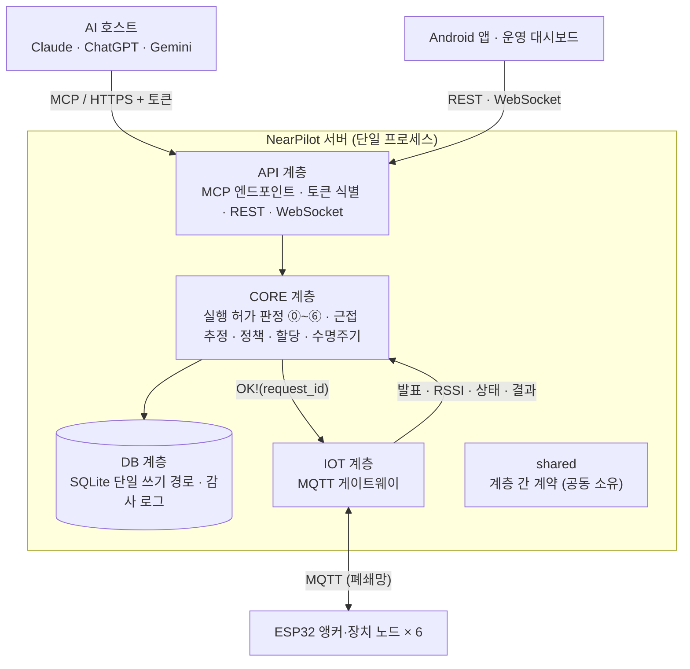
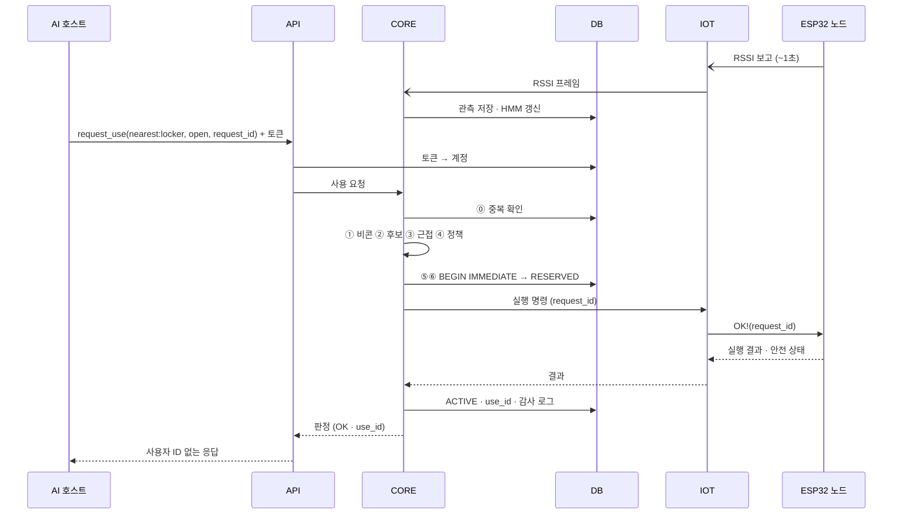

# NearPilot 서버 아키텍처

> 요구사항은 [PRD](./prd.md)와 [요구사항 분석서](../bedrock/NearPilot_요구사항분석서.md)를 따른다. 이 문서는 **서버 저장소의 구조와 4인 분담**을 정한다.

## 1. 4계층 구조

분석서 3장 시스템 구성도의 서버 내부 4계층(API · CORE · DB · IOT)을 그대로 저장소 구조로 옮기고, 계층 하나를 한 명이 맡는다.



| 계층 | 담당 | 책임 | 관련 요구사항 |
|---|---|---|---|
| **API** | (미정) | MCP Streamable HTTP 엔드포인트와 도구 6개, 토큰으로 계정 식별, 앱·대시보드용 REST, 실시간 모니터링 WebSocket, 응답에서 사용자 ID 제거 | FR-08·09·10·11, FR-01·03·12A·12B(서버 측), NFR-01·07·08·09·11, UC-02·03·10 |
| **CORE** | (미정) | ⓪~⑥ 결정론적 판정, 근접 추정(관측 모델 + HMM), 재질문, 접근 정책·승인, 전역 할당, 상태 머신·해제·FAULT 복구 | FR-13~21·23, NFR-02·04·05·06, UC-04~09·11 |
| **DB** | (미정) | SQLite 스키마(10개 테이블), 단일 쓰기 경로와 `BEGIN IMMEDIATE` 원자적 점유, 저장소 조회, 감사 로그(테이블 + JSONL), 공개용 데이터셋 추출 | FR-19(원자성)·22, NFR-03·13, 부록 A |
| **IOT** | (미정) | MQTT 브로커 연결, 노드 발견·RSSI·상태·실행 결과 수신과 검증, 실행 명령 전송과 결과 대기(타임아웃), 노드별 자격정보, 노드 시뮬레이터 | FR-04~07(서버 측), NFR-08·10·12, 지표 8 수집 |
| **shared** | 4인 공동 | 계층 사이에서 오가는 데이터 모델·열거형·인터페이스 정의 | 부록 A 열거형 |

> 작업량은 CORE가 가장 크다(판정 + 근접 모델 + 할당). 근접 모델 학습용 RSSI 수집(`tools/data_collection`)은 IOT 담당이, 평가 스크립트(`tools/evaluation`)는 DB 담당이 함께 맡는 식으로 나누는 것을 권장한다.

## 2. 폴더 구조

```
.
├── bedrock/
│   └── NearPilot_요구사항분석서.md   레포 지식의 근본 (원본 요구사항, 모든 문서의 출처)
├── docs/
│   ├── prd.md                       분석서에서 파생
│   └── architecture.md              분석서에서 파생 (이 문서)
├── src/nearpilot/
│   ├── shared/            [공동]  계층 간 계약: 도메인 모델 · 열거형 · 인터페이스
│   ├── api/               [API]
│   │   ├── mcp/           MCP 엔드포인트 · 도구 6개 (FR-08~11)
│   │   ├── auth/          토큰 → 계정 식별, 무효 토큰 거부 (E6)
│   │   ├── rest/          앱(계정·승인) · 대시보드(신뢰·정책·복구) API
│   │   └── ws/            실시간 모니터링 (FR-12B)
│   ├── core/              [CORE]
│   │   ├── decision/      ⓪~⑥ 판정 파이프라인 (FR-15·18)
│   │   ├── proximity/     관측 모델 · HMM · 재질문 임계값 (FR-16·17)
│   │   ├── policy/        접근 정책 · 승인 검사 (FR-14)
│   │   ├── allocation/    전역 할당 (FR-23)
│   │   └── lifecycle/     상태 머신 · 자동 해제 · FAULT 복구 (FR-19·20, NFR-04)
│   ├── db/                [DB]
│   │   ├── schema/        DDL · 마이그레이션
│   │   ├── repositories/  테이블별 저장소 · 원자적 점유
│   │   └── audit/         감사 로그 (FR-22)
│   └── iot/               [IOT]
│       ├── mqtt/          브로커 연결 · 구독 · 명령 전송
│       └── messages/      MQTT 페이로드 스키마 (펌웨어와의 계약)
├── tests/
│   ├── api/  core/  db/  iot/     계층별 단위 테스트 — 각 담당자
│   └── integration/               계층을 합친 시나리오 테스트 — 공동
└── tools/
    ├── node_sim/          가상 ESP32 노드 (하드웨어 없이 개발·부하 시험) — IOT
    ├── data_collection/   RSSI 라벨 수집 (지표 8) — IOT
    └── evaluation/        지표 1~9 평가 표·그래프 생성 (NFR-13) — DB
```

각 담당자는 자기 계층 폴더와 `tests/<계층>/` 안에서만 작업한다. 다른 계층 폴더를 고쳐야 하면 그 담당자에게 요청한다.

## 3. 의존 규칙

```
api  ──▶  core  ──▶  db
            │  ◀──  iot      (iot → core 는 이벤트 전달, core → iot 는 실행 명령)
모든 계층 ──▶ shared
```

1. **api는 db를 직접 부르지 않는다.** 예외는 토큰 → 계정 식별 하나뿐이다.
2. **core만 판정한다.** api와 iot는 판정 결과를 전달할 뿐 허가 여부를 바꾸지 않는다 (NFR-07).
3. **iot는 core가 보낸 OK 없이는 노드에 실행 명령을 보내지 않는다** (FR-06).
4. **계층끼리는 서로의 구현이 아니라 `shared`에 정의한 인터페이스에만 의존한다.** 그래서 각자 가짜 구현(fake)으로 다른 계층 없이 개발·테스트할 수 있다.
5. **db의 쓰기는 한 경로로만 한다.** ⑤⑥ 검사와 RESERVED 생성은 `BEGIN IMMEDIATE` 트랜잭션 하나에서 처리한다 (FR-19, NFR-03).

## 4. 계층 간 계약 (shared)

`shared`에 둘 인터페이스 목록이다. 구현 전 첫 주에 4인이 함께 확정하고, 이후 변경은 4인 리뷰를 거친다.

| 인터페이스 | 제공 | 사용 | 내용 |
|---|---|---|---|
| 저장소 인터페이스 | DB | CORE (API는 계정 식별만) | 계정·비콘, 노드, 정책·승인, 요청·판정, 점유 세션, RSSI 관측 조회·저장, 원자적 점유(`reserve_if_free`) |
| 감사 로그 인터페이스 | DB | CORE | 단계별 입력·결과·버전·임계값·후보 확률 기록 |
| 노드 명령 인터페이스 | IOT | CORE | 실행 명령 전송 후 결과 대기. 시간 초과·연결 끊김은 예외가 아니라 "실패·안전 상태 불명" 결과로 돌려준다 |
| 노드 이벤트 인터페이스 | CORE | IOT | 기능 발표, RSSI 프레임, 안전 상태 보고를 전달받음 |
| 기능 인터페이스 | CORE | API | MCP 도구 6개와 관리 기능(계정 등록, 노드 신뢰, 정책, 승인, FAULT 복구) |
| 도메인 모델·열거형 | 공동 | 전체 | 부록 A의 상태값, 판정 결과(OK·BUSY·ASK·DENY·NEED_APPROVAL), 사유 코드, 요청·판정·세션 값 객체 |

판정 결과를 호스트에 돌려줄 때는 사용자 ID와 점유 주체를 빼는 변환을 반드시 거친다 (FR-11, NFR-08).

## 5. UC-04 계층 간 흐름



## 6. 외부 인터페이스 (초안)

인터페이스별 담당자가 확정한다. 확정되면 이 절을 갱신한다.

### MCP 도구 (API) — FR-09

| 도구 | 기능 | 비고 |
|---|---|---|
| `find_available_devices` | 주변 장치 조회 (UC-03) | 비콘 미수신이면 빈 목록 |
| `get_device_state` | 장치 상태 조회 (UC-10) | 점유 주체 비노출 |
| `request_access` | 제한 장치 접근 요청 (UC-08) | |
| `request_use` | 사용 요청·실행 허가 (UC-04) | 호스트가 만든 `request_id`가 멱등 키 |
| `release_use` | 사용 종료·해제 (UC-09) | 이름은 제안 (PRD 미결 사항 4) |
| `get_use_status` | 사용 상태 조회 (UC-10) | 본인 `use_id`만 (FR-21) |

### MQTT 토픽 (IOT) — 펌웨어와 공유

| 토픽 | 방향 | 용도 |
|---|---|---|
| `nearpilot/node/{node_id}/announce` | 노드 → 서버 | 기능 발표 (FR-04), retained |
| `nearpilot/node/{node_id}/rssi` | 노드 → 서버 | 약 1초 스캔 결과 (FR-05) |
| `nearpilot/node/{node_id}/status` | 노드 → 서버 | 하트비트 · 안전 상태 (FR-07) |
| `nearpilot/node/{node_id}/result` | 노드 → 서버 | 실행 결과 (FR-07) |
| `nearpilot/node/{node_id}/cmd` | 서버 → 노드 | `OK!(request_id)` 실행 명령 (FR-06) |

### REST · WebSocket (API)

| 그룹 | 사용처 | 요구사항 |
|---|---|---|
| 계정 | 앱: 계정·비콘 등록, MCP 연결용 토큰 발급 | FR-01, UC-01 |
| 승인 | 앱: 대기 중 승인 목록, 승인·거부 | FR-03, UC-08 |
| 관리 | 대시보드: 노드 목록·신뢰·장소 배치·정책·FAULT 복구 | FR-12A, UC-11 |
| 모니터링 (WebSocket) | 대시보드: 판정·사후확률·상태 머신·감사 로그 스트림 | FR-12B |

## 7. 기술 스택 (제안)

분석서가 정한 것은 SQLite, MQTT, MCP Streamable HTTP, WebSocket, HTTPS REST, pytest다. 나머지는 제안이며 첫 주에 확정한다.

| 항목 | 제안 | 이유 |
|---|---|---|
| 언어 | Python 3.12+ | pytest 회귀(NFR-13), numpy·scipy로 HMM·할당 구현 |
| MCP | 공식 `mcp` Python SDK 2.x | 2.x부터 `FastMCP`가 `MCPServer`로 이름이 바뀌었으니 1.x 예제를 그대로 쓰지 않는다 |
| HTTP | FastAPI + uvicorn | MCP 앱을 같은 프로세스에 마운트 (FR-08) |
| MQTT 클라이언트 | paho-mqtt | Windows 시연 노트북에서도 스레드 기반으로 동작 |
| 브로커 | Mosquitto (독립 AP 내부) | NFR-12 |
| DB | SQLite (WAL) | FR-19 |

## 8. 협업 규칙

1. 브랜치는 계층 단위로 딴다: `api/…`, `core/…`, `db/…`, `iot/…`, 공동 계약은 `shared/…`.
2. `shared` 변경은 4인 모두 리뷰한다. 계층 폴더 변경은 담당자 리뷰로 충분하다.
3. 커밋·PR·테스트 이름에 요구사항 ID를 적는다 (예: `FR-19 원자적 점유`).
4. 각 FR마다 pytest 케이스를 하나 이상 둔다 (분석서 부록 D 기능 시험).
5. 계층을 합친 시나리오(대표 시연 4장면)는 `tests/integration/`에 공동으로 작성한다.
