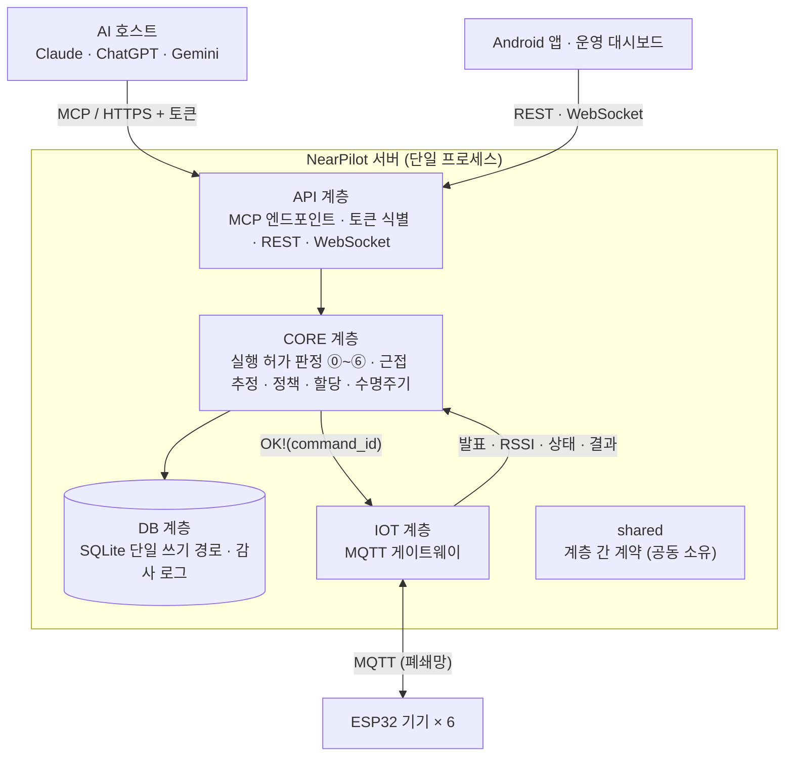
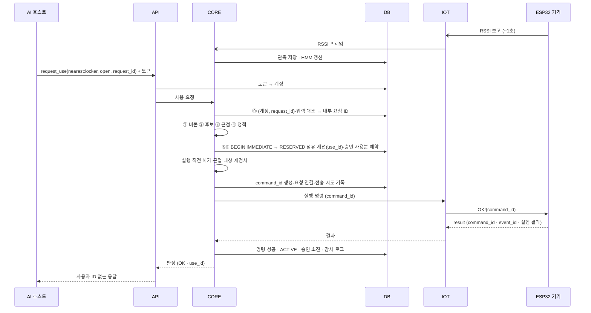
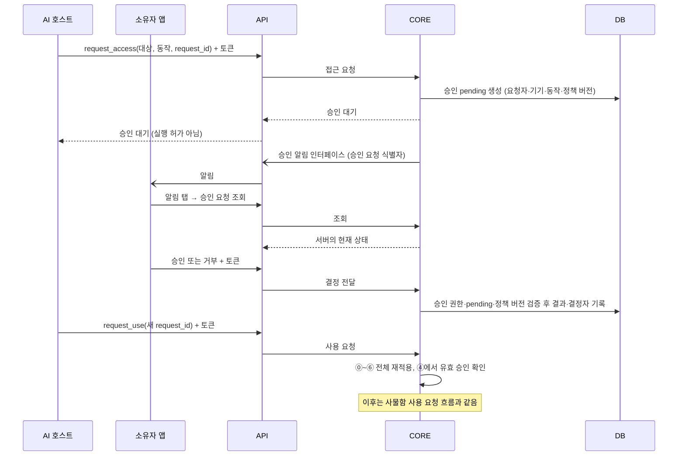

# 아키텍처

<!--
이 문서는 "영역은 어떻게 나뉘고 어떻게 연결되는가"에 답한다.
쓰는 것: 영역, 디렉터리, 담당, 의존 관계, 영역 간 계약, 외부 계약, 데이터 계약, 영역을 넘는 흐름, 기술 스택
쓰지 않는 것: 영역 내부 구조 (spec과 코드), 요구사항 (requirements.md)
이 문서에는 제공 영역, 사용 영역, 약속과 외부 메시지 형식을 쓴다.
shared의 시그니처는 계약 구현 때 맞춘다. 문서 반영만으로 코드 구현을 완료한 것으로 보지 않는다.
-->

## 1. 구성

서버는 API, CORE, DB, IOT의 4계층으로 구성한다. 4인의 역할은 **판정, 근접 추정, 상태 관리, DB**다. 계층 구조와 사람의 역할 분담은 서로 다르다.



| 계층 | 책임 | 관련 요구사항 |
|---|---|---|
| **API** | MCP Streamable HTTP 엔드포인트와 도구 6개, 토큰으로 계정 식별, 앱과 대시보드용 REST, 실시간 모니터링 WebSocket, 소유자 앱 승인 알림 전달, 응답에서 사용자 ID 제거 | FR-08, FR-09, FR-10, FR-11. 서버 측: FR-01, FR-03, FR-12A, FR-12B. NFR-01, NFR-07, NFR-08, NFR-09, NFR-11 |
| **CORE** | ⓪~⑥ 결정론적 판정, 실행 직전 재검사, 근접 추정 (관측 모델과 HMM), 재질문, 접근 정책과 승인, 전역 할당, 상태 머신, 해제, `FAULT` 복구 | FR-13~FR-21, FR-23, NFR-02, NFR-04, NFR-05, NFR-06 |
| **DB** | SQLite 스키마, 단일 쓰기 경로와 `BEGIN IMMEDIATE` 원자적 점유, 저장소 조회, 감사 로그 (테이블과 JSONL), 공개용 데이터셋 추출 | FR-19 (원자성), FR-22, NFR-03, NFR-13 |
| **IOT** | MQTT 브로커 연결, 기기 발견, RSSI, 상태, 실행 결과의 수신과 검증, 실행 명령 전송과 결과 대기 (타임아웃), 기기별 자격정보, 기기 시뮬레이터 | 서버 측: FR-04~FR-07. NFR-08, NFR-10, NFR-12, 지표 8 수집 |
| **shared** | 계층 사이에서 오가는 데이터 모델, 열거형, 인터페이스의 정의. 4인이 공동으로 소유한다. | FR-09, FR-18, FR-19 |

## 2. 영역과 담당

### 디렉터리

```
nearpilot-server/
├── AGENTS.md                   에이전트 지침
├── CLAUDE.md                   AGENTS.md를 불러온다
├── docs/                       제품, 요구사항, 아키텍처, 문체와 용어
├── specs/                      작업 명세 specs/{계층}-{요약}/spec.md
│   └── _template/              spec 양식
├── .github/                    이슈 양식, PR 양식, CI
├── server/
│   ├── pyproject.toml
│   ├── src/nearpilot/
│   │   ├── shared/             계층 간 계약: 도메인 모델, 열거형, 인터페이스, 설정
│   │   ├── api/
│   │   │   ├── mcp/            MCP 엔드포인트와 도구 6개 (FR-08~FR-11)
│   │   │   ├── auth/           토큰으로 계정 식별, 무효 토큰 거부
│   │   │   ├── rest/           앱(계정, 승인)과 대시보드(신뢰, 정책, 복구)용 API
│   │   │   └── ws/             실시간 모니터링 (FR-12B)
│   │   ├── core/
│   │   │   ├── decision/       ⓪~⑥ 판정 파이프라인 (FR-15, FR-18)
│   │   │   ├── proximity/      관측 모델, HMM, 재질문 임계값 (FR-16, FR-17)
│   │   │   ├── policy/         접근 정책과 승인 검사 (FR-14)
│   │   │   ├── allocation/     전역 할당 (FR-23)
│   │   │   └── lifecycle/      상태 머신, 명시적 해제, 초과시간 계산, FAULT 복구 (FR-19, FR-20, NFR-04)
│   │   ├── db/
│   │   │   ├── schema/         DDL과 마이그레이션
│   │   │   ├── repositories/   테이블별 저장소와 원자적 점유
│   │   │   └── audit/          감사 로그 (FR-22)
│   │   └── iot/
│   │       ├── mqtt/           브로커 연결, 구독, 명령 전송
│   │       └── messages/       MQTT 페이로드 스키마 (펌웨어와의 계약)
│   ├── tests/
│   │   ├── api/ core/ db/ iot/ shared/    계층별 단위 테스트
│   │   └── integration/        계층을 합친 시나리오 테스트
│   └── tools/
│       ├── node_sim/           가상 ESP32 기기 (하드웨어 없이 개발과 부하 시험)
│       ├── data_collection/    RSSI 라벨 수집 (지표 8)
│       └── evaluation/         지표 1~9 평가 표와 그래프 생성 (NFR-13)
├── app/                        Android 앱 (비콘 송출, 알림)
├── dashboard/                  운영 대시보드 (웹)
└── firmware/                   ESP32 기기 펌웨어
```

### 담당

표의 경로는 `server/` 기준이다. 테스트는 `tests/` 아래 같은 이름의 폴더에 둔다.

| 역할 | 담당 폴더 | 책임 |
|---|---|---|
| **판정** | `src/nearpilot/core/decision/`, `core/allocation/`, `api/mcp/`, `api/auth/` | 판정 ⓪~⑥ 조합, 근접, 정책, 점유 결과의 반영, 실행 직전 재검사, 전역 할당, MCP 도구 6개, 토큰으로 계정 식별 |
| **근접 추정** | `src/nearpilot/core/proximity/`, `tools/data_collection/` | 관측 모델과 HMM, 사후확률 계산, 근접 추정 인터페이스, RSSI 라벨 수집 |
| **상태 관리** | `src/nearpilot/core/lifecycle/`, `iot/`, `tools/node_sim/` | 예약 뒤의 상태 전이, 대여 점유 유지와 초과시간 계산, 명시적 해제, `FAULT` 복구, MQTT 게이트웨이, 기기 시뮬레이터 |
| **DB** | `src/nearpilot/db/`, `core/policy/`, `tools/evaluation/` | 스키마, 저장소, 원자적 점유와 승인 사용분, 감사 로그, 평가 스크립트, 접근 정책과 승인 검사, 토큰 해시로 계정 조회 (`AccountLookup`) |
| **공동** | `src/nearpilot/shared/`, `tests/integration/` | 계층 간 계약, 계층을 합친 시나리오 테스트 |

- 이 표는 역할별 담당 범위를 기록한다. 개인 이름은 쓰지 않는다.
- 미결: `api/rest/`와 `api/ws/`의 담당. 앱과 대시보드의 담당을 정할 때 함께 배정한다.
- 미결: 앱(`app/`)과 대시보드(`dashboard/`)의 담당. 서버 담당 업무를 먼저 마친 사람이 맡는다.
- 미결: 펌웨어(`firmware/`)의 담당

## 3. 의존 관계

```
api  ──▶  core  ──▶  db
            │  ◀──  iot      (iot → core 는 이벤트 전달, core → iot 는 실행 명령)
모든 계층 ──▶ shared
```

의존 규칙은 `AGENTS.md` "코딩 규칙"에 있다.

## 4. 영역 간 계약

| 계약 | 제공 | 사용 | 약속 |
|---|---|---|---|
| 저장소 인터페이스 | DB | CORE (API는 계정 식별만) | 계정과 비콘, 기기, 정책 이력과 승인 사용분, 외부 키와 내부 요청 ID와 명령 ID의 연결, 점유 세션, RSSI 관측, 원자적 점유와 승인 예약 (`reserve_if_free`) |
| 감사 로그 인터페이스 | DB | CORE | 단계별 입력, 결과, 버전, 임계값, 후보 확률의 기록 |
| 기기 명령 인터페이스 | IOT | CORE | `command_id`별로 전송과 결과를 추적한다. 확실한 미전송, 전송 뒤 성공, 전송 뒤 실패, 결과 불명을 구분한다. 시간 초과와 연결 끊김을 미실행으로 보지 않는다. |
| 기기 이벤트 인터페이스 | CORE | IOT | CORE는 기능 발표, RSSI 프레임, 원시 물리 관측과 늦은 실행 결과 사건을 받는다. 안전은 CORE가 판단한다. |
| 기능 인터페이스 | CORE | API | MCP 도구 6개와 관리 기능 (계정 등록, 기기 신뢰, 정책, 승인, `FAULT` 복구) |
| 승인 알림 인터페이스 | API | CORE | 승인 대기가 생기면 CORE가 소유자 앱 알림을 요청한다. 요청에는 승인 요청 식별자를 담는다. 전달 실패는 승인 상태와 판정을 바꾸지 않는다. 전달 수단은 미결이다 (FR-03). |
| 도메인 모델·열거형 | 공동 | 전체 | 상태 값, 판정 결과 (`OK`, `BUSY`, `ASK`, `DENY`, `NEED_APPROVAL`), 사유 코드, 요청과 판정과 점유 세션의 값 객체 |

- 명령을 보내지 않은 것이 확실한 취소에만 CORE는 예약과 승인 사용분을 자동으로 반환한다.
- 전송을 시도한 뒤 결과가 실패하거나 불명이면 CORE는 불명확한 점유와 승인 사용분을 보류하고 기기를 `FAULT`로 둔다.
- IOT는 새 명령 ID로 자동 재시도하지 않는다.
- 실행 직전 재검사는 자기 요청의 예약을 경합으로 판정하지 않는다.
- 공용 조명의 자동 꺼짐은 초기에 비활성이다.

### 실행 인계와 재검사

[#16](https://github.com/capstone-itda/nearpilot-server/issues/16)의 인계 계약을 따른다.
판정은 최초 허가와 필요한 예약 뒤 `context` 하나를 상태 관리에 전달한다.

| 정보 | 약속 |
|---|---|
| `internal_request_id` | 기존 요청과 실행 건을 찾는다. |
| 원래 `UseRequest` | 토큰 계정, 외부 요청 ID, 원래 대상 지정과 동작을 유지한다. |
| 확정한 `node_id` | 재검사와 실행의 물리 대상을 고정한다. |
| `use_id`, `usage_id` | 자기 예약과 승인 사용분을 찾는다. 없으면 `None`이다. |
| 적용한 `Settings` | 실제 설정 값과 버전을 유지한다. |

- 상태 관리는 `execute(context)`를 제공한다. 판정은 이 접점으로 실행을 인계한다.
- 판정은 `recheck(context)`를 제공한다. 상태 관리는 전송 직전에 이 접점을 호출한다.
- 재검사는 `Decision`을 반환한다. `OK` 외 판정과 사유는 그대로 전달한다.
- 검사 예외는 정상 거부와 구분한다. 두 경우 모두 상태 관리는 전송을 차단한다.
- 확실한 미전송이면 상태 관리는 DB에 예약과 승인 사용분의 취소를 요청한다.
- 같은 내부 요청의 중복 인계는 기존 진행 상태나 결과를 반환한다. 동시 인계도 실행을 한 번만 시작한다.
- 서로 다른 요청의 반납과 후속 동작을 같은 실행 건으로 합치지 않는다.
- 상태 관리는 미전송, 진행 중, 성공, 실패, 불명을 구분한다. 명령 결과에는 `CommandResult`를 활용한다.
- 내부 계정 정보는 호스트 응답으로 보내지 않는다. 완료 안내는 실행 성공과 필요한 저장 반영 뒤에 한다.
- DB는 대여형 예약 때 `use_id`를 만든다. 서버는 실행 성공과 필요한 저장 반영 뒤에만 `use_id`를 호스트에 반환한다.
- 미결 — #16: 예외 전달 방식과 요청에 연결된 진행 상태의 상세 반환 타입

### 예약 이후 저장

[#17](https://github.com/capstone-itda/nearpilot-server/issues/17)의 사건별 원자적 저장 계약을 따른다.
CORE는 실행·종료·안전을 판단한다. DB는 현재 상태와 기록 연결을 검사하고 저장을 보장한다.

| 사건 또는 조회 | 입력 | 함께 반환하거나 반영할 내용 |
|---|---|---|
| 기존 실행 조회와 명령 연결 | 내부 요청 ID, 확정 기기와 동작 | 기존 명령과 진행 상태를 반환한다. 중복 인계로 새 명령을 만들지 않는다. |
| 전송 시작 | 요청·명령 참조와 실행 전 준비 상태 | 취소 여부와 현재 상태를 검사한다. 시작 기록과 이번 호출의 시작 허용 여부를 반환한다. |
| 확실한 미전송 취소 | 요청·예약·명령·사용분 참조, 사유와 근거 | 예약 정리, 사용분 반환, 명령 상태와 감사 테이블 기록을 함께 반영한다. |
| 실행 성공 | 명령 ID와 완료 근거 | 명령 성공, 대여형 기기와 세션 `ACTIVE`, 사용분 소진과 감사 기록을 함께 반영한다. |
| 실행 실패 또는 불명 | 명령 ID, 구분한 결과와 근거 | 명령 실패 또는 불명, 기기 `FAULT`, 사용분 `held`, 감사 기록을 함께 반영한다. 불명확한 세션을 보존한다. |
| 종료 시작 | 본인 세션 ID, 종료 사유와 현재 상태 | 기기와 세션의 `CLOSING`을 함께 반영한다. |
| 안전 종료 | 세션 ID, 현재 상태와 CORE의 안전 근거 | 세션 `CLOSED`, 기기 `AVAILABLE`, `closed_at`과 종료 기록을 함께 반영한다. |
| 복원 조회 | 진행 중 요청·명령·세션의 식별 정보 | 전송 시도와 결과, 점유, 사용분, 생성 당시 종료 정책과 대여시간 기준을 함께 조회한다. |
| 복구 정산 | 복구 건, CORE의 실행·안전 근거와 소유자 승인 | 사용분 정산, 점유 종료, 기기 복구와 감사 기록을 함께 반영한다. |

- DB는 요청·기기·세션·명령·사용분의 연결을 확인한다.
- 취소와 전송 시작이 경합하면 한쪽만 성공한다. 취소한 예약은 전송을 시작할 수 없다.
- 이미 반영한 전송 시작은 재전송 허가가 아니다. 중복 호출은 기존 진행 상태를 반환한다.
- 같은 사건 식별자에 다른 내용이 오면 DB는 기존 기록을 보존하고 충돌을 반환한다.
- DB는 반영 성공, 이미 반영함, 상태·입력 충돌, 저장 오류를 구분한다.
- 저장 오류는 변경 없음이 확실한 경우와 반영 여부가 불명인 경우를 구분한다.
- 반영 여부가 불명이면 요청·명령·사건 식별자로 결과를 다시 조회한다.
- CORE는 필요한 저장 반영을 확인하기 전에는 완료와 재사용을 확정하지 않는다.
- DB 전송 시작 기록은 실제 MQTT 전송과 별개다. 기록만으로 실행 성공과 미전송을 확정하지 않는다.
- 공용형에는 세션과 `CLOSING`을 만들지 않는다. 제한 공용형도 사용분을 실행 전에 원자적으로 확보한다.
- 늦은 결과와 복구 재호출은 중복 정산과 완료 상태의 되돌림을 만들지 않는다.
- 미결 — #17: 사건 식별 방식, 함수·입력·반환 타입, 복원 조회와 복구 정산의 상세 형식

### 이탈 판단의 관측 계약

[#18](https://github.com/capstone-itda/nearpilot-server/issues/18)의 B안을 따른다.
같은 장소의 다른 앵커가 받은 본인 비콘의 유효 관측도 이탈 타이머에 반영한다.

- 관측에는 계정, 비콘, 관측한 기기, 관측 시각, 서버 수신 시각과 중복 식별 정보를 담는다.
- 앵커·기기와 장소의 연결 정보로 같은 장소인지 확인한다.
- 관측 시각과 서버 수신 시각은 구분한다. 최신성과 중복 검사는 §5의 MQTT 계약 v1을 따른다.
- 과거 관측의 재전송은 새 수신으로 인정하지 않는다. 다른 계정과 다른 장소의 관측은 타이머를 초기화하지 않는다.
- 근접 추정은 확률 계산을 맡는다. 상태 관리는 유효 관측의 장소 범위로 이탈 시간을 잰다.
- 이 계약은 새 조작의 허가·근접 검사를 면제하지 않는다. 대여형은 이탈만으로 점유를 해제하지 않는다.
- 관측 전달 모델의 상세 타입과 비콘 매핑 접점은 공동 인터페이스와 관련 spec에서 맞춘다.

### 관리 API의 남은 계약

- 미결 — #20: 복구 준비 조회와 승인 요청의 분리, 복구 건 식별과 반복 승인 결과
- 관리 API는 인증한 계정을 CORE에 전달한다. 소유권과 복구 준비 조건은 CORE가 확인한다.
- REST 경로와 화면 구성은 미결이다.

### 공동 인터페이스의 후속 반영

- 현재 `shared`는 이 문서의 새 계약을 모두 구현하지 않았다.
- 실행 인계 객체, 요청에 연결된 진행 상태와 사건별 저장 접점은 #16·#17에 맞춰 추가한다.
- `UseSession.expires_at`은 대여시간 기준 `rental_due_at`으로 분리한다. `closed_at`과 생성 당시 종료 정책도 전달한다.
- 현재 `NodeEventSink`에는 늦은 결과 접점이 없다. #19의 결과 사건 전달 계약을 추가한다.
- 현재 `NodeStatus.safe`를 IOT의 안전 판단으로 쓰지 않는다. 원시 관측과 최신성을 전달하고 CORE가 판단한다.
- 현재 `CommandResult.safe`를 종료 안전의 근거로 쓰지 않는다. 명령 실행 성공과 종료 안전은 별개다 (§5.7).
- 연결 ID, 관측 시각, 결과 사건 ID와 시각은 #19에 맞춰 공동 모델에 반영한다.
- 현재 `NodeCommand`에는 §5.3 `cmd`의 `target_session_id`, `issued_at`, `expires_at`이 없다. #19에 맞춰 추가한다.
- 현재 `Settings`에는 §5.6의 하트비트 간격, RSSI 허용 나이, 명령 유효 시간, 안전 보고 허용 나이, 시각 오차 허용값과 예약 대기 제한이 없다. 값은 #15와 실제 기기 검증에 맞춰 정한다.
- 계정·비콘·관측 기기·장소·관측 시각·수신 시각·중복 정보의 전달은 #18의 장소 범위와 #19의 최신성 기준을 함께 따른다.
- 개별 저장 함수의 연속 호출만으로 사건 전체의 원자성을 보장한다고 가정하지 않는다.

## 5. 외부 계약

### MCP

도구 목록과 도구별 계약은 `requirements.md` FR-09에 있다. 외부 멱등 키는 `(계정, request_id)`다.

### MQTT

서버와 시뮬레이터는 [#19](https://github.com/capstone-itda/nearpilot-server/issues/19)의 MQTT 계약 v1을 개발 기준으로 쓴다.
실제 기기 검증은 미결이다. 브로커 제품과 실행 방법도 미결이다.
페이로드 스키마의 구현 경로는 `server/src/nearpilot/iot/messages/`다.

#### 1. MQTT 전달 설정

MQTT 3.1.1과 UTF-8 JSON 객체를 사용한다. 서버와 기기는 `clean_session=true`로 접속하고 매번 구독한다. 브로커 제품과 실행 방법은 별도로 정한다.

기존 토픽 `nearpilot/node/{node_id}/{종류}`를 유지한다. 발행 QoS와 구독 QoS는 다음 표를 따른다.

| 종류 | 방향 | QoS | retain |
|---|---|---|---|
| `announce` | 기기 → 서버 | 1 | true |
| `rssi` | 기기 → 서버 | 0 | false |
| `status` | 기기 → 서버 | 1 | false |
| `result` | 기기 → 서버 | 1 | false |
| `cmd` | 서버 → 기기 | 1 | false |

- MQTT의 전송 확인은 물리 실행 성공을 뜻하지 않는다. 서버는 `result`의 명령 결과를 확인한다.
- `clean_session`은 브로커의 이전 세션을 지운다. retained 기능 발표는 연결이 끝나도 남을 수 있다.
- 클라이언트가 전송 중인 메시지를 다시 발행할 수 있다. 서버와 기기는 아래 명령 ID·연결 ID·만료 검사로 대응한다.
- 기기는 자기 토픽의 보고만 발행하고 자기 `cmd`만 구독한다. 실행 명령은 서버만 발행한다.
- 서버는 기기별 자격정보, 토픽의 `node_id`, 본문의 `node_id`를 대조한다. 기기의 발표는 신뢰 부여가 아니다.

전달 동작의 근거는 [MQTT 3.1.1 규격](https://docs.oasis-open.org/mqtt/mqtt/v3.1.1/mqtt-v3.1.1.html)과 [Paho 클라이언트 문서](https://eclipse.dev/paho/files/paho.mqtt.python/html/client.html)다.

#### 2. 공통 형식

모든 메시지는 `schema_version: 1`과 `node_id`를 담는다. ID는 비어 있지 않은 문자열이다. 시각은 RFC 3339의 UTC 문자열로 쓴다. 예시는 `2026-10-09T03:00:00.000Z`다.

기기 → 서버 메시지는 다음 필드도 담는다.

| 필드 | 타입 | 의미 |
|---|---|---|
| `session_id` | 문자열 | 기기가 MQTT에 접속할 때 새로 만드는 UUID다. 재접속과 재시작마다 바꾼다. |
| `seq` | 정수 | 같은 연결·토픽에서 1부터 증가하는 발행 순번이다. |
| `sent_at` | UTC 시각 | 메시지를 발행한 시각이다. 관측 시각과 구분한다. |

- 필수 필드 누락, 타입 오류, 지원하지 않는 버전은 수신자가 거부하고 기록한다.
- 수신자는 알 수 없는 추가 필드를 실행·안전 판정에 사용하지 않는다. 필수 필드의 뜻을 바꾸면 스키마 버전을 올린다.
- 서버는 사용자 ID, 외부 요청 ID, 승인 정보, 점유 주체를 기기에 보내지 않는다. 내부 연결은 서버가 명령 ID로 조회한다.

#### 3. 토픽별 본문

다음 표는 공통 필드 외에 필요한 필드다. `?`는 선택 필드다. 관측값의 `null`은 확인하지 못했다는 뜻이다.

| 종류 | 추가 필드와 타입 | 약속 |
|---|---|---|
| `announce` | `capability`: `locker` 또는 `light`, `occupancy`: `rental` 또는 `shared` | 기기는 연결마다 발표한다. 서버는 retained 발표만으로 온라인·안전·현재 연결을 확정하지 않는다. |
| `rssi` | `frame_ts`: UTC 시각, `observations`: 배열 | `frame_ts`는 스캔 관측 시각이다. 각 원소는 `uuid`, `major`, `minor`, `rssi`를 담는다. 빈 배열도 허용한다. |
| `status` | `observed_at`: UTC 시각, `physical_state`: 객체 | 기기는 현재 물리 관측을 보고한다. 서버의 점유 상태나 `AVAILABLE`을 기기가 정하지 않는다. |
| `result` | `command_id`: 문자열, `event_id`: UUID 문자열, `state`: 아래 상태 값, `occurred_at`: UTC 시각, `error_code?`: 문자열 | 결과 사건을 다시 보고할 때 `event_id`, 상태 값, 발생 시각을 유지한다. 발행 순번과 발행 시각은 새로 부여한다. |
| `cmd` | `command_id`: 문자열, `action`: `open`·`on`·`off`, `target_session_id`: 문자열, `issued_at`: UTC 시각, `expires_at`: UTC 시각 | 서버는 현재 확인한 기기 연결을 지정한다. `open`은 사물함, `on`·`off`는 조명에만 보낸다. |

RSSI의 `uuid`는 하이픈을 포함한 소문자 UUID 문자열이다. `major`와 `minor`는 0~65535의 정수다. `rssi`는 dBm 단위의 유한한 수다. 프레임 하나는 같은 비콘 조합을 중복으로 담지 않는다.

`physical_state`는 다음 네 필드를 담는다. 기능에 맞지 않거나 확인할 수 없는 값은 `null`로 쓴다.

| 필드 | 값 | 의미 |
|---|---|---|
| `door_closed` | bool 또는 null | 사물함 문 닫힘 관측이다. |
| `light_on` | bool 또는 null | 조명 켜짐 관측이다. |
| `actuator_state` | `idle`·`busy`·`unknown` | 구동부가 동작 중인지 보고한다. |
| `sensor_fault` | bool 또는 null | 센서 이상 여부다. |

기기가 `safe: true`로 서버의 안전 판정을 대신하지 않는다. IOT는 관측을 검증해서 CORE에 전달한다.

#### 4. 명령 접수와 중복 처리

기기는 명령 ID의 저장 기록을 먼저 조회한다.

1. 기록이 있고 명령 내용이 같으면 기기는 저장한 진행 상태나 결과를 보고한다. 물리 동작을 다시 시작하지 않는다.
2. 기록이 있는데 내용이 다르면 기기는 `COMMAND_ID_CONFLICT`로 거부한다. 기존 기록을 덮어쓰지 않는다.
3. 새 명령이면 기기는 버전, 대상 연결, 기능별 동작, 유효 시간을 검사한다.
4. 검사를 통과하면 기기는 접수 기록을 재시작 뒤에도 남도록 저장한다. 저장을 확인한 뒤 물리 동작을 시작한다.

같은 명령의 내용은 `node_id`, `action`, `target_session_id`, `issued_at`, `expires_at`다. 서버는 재전송할 때 이 내용을 바꾸지 않는다. 중복 조회는 연결·만료 검사보다 먼저 한다. 오래된 중복 명령에도 기존 결과만 반환한다.

새 명령의 대상 연결이 다르거나 유효 시간이 지났으면 기기는 실행하지 않는다. 시각의 신뢰성을 확인할 수 없어도 실행하지 않는다. 기기는 유효한 명령 ID를 읽을 수 있을 때 `rejected`와 거부 코드를 보고한다.

기기는 물리 동작 시작 직전에도 대상 연결과 유효 시간을 검사한다. 기기는 접수 후의 대기 때문에 만료한 명령을 실행하지 않는다.

거부 코드는 `SESSION_MISMATCH`, `COMMAND_EXPIRED`, `CLOCK_UNVERIFIED`, `UNSUPPORTED_ACTION`, `COMMAND_ID_CONFLICT`, `INVALID_MESSAGE`, `STORAGE_ERROR`를 사용한다. 명령 기록 충돌 보고는 기존 명령의 정상 결과를 덮어쓰는 근거가 아니다.

재시작 뒤 접수·실행 기록만 있고 결과를 증명하지 못하면 기기는 `unknown`을 보고한다. 기기는 자동으로 동작을 재개하지 않는다. 초기 구현에서는 명령 중복 방지 기록을 자동 삭제하지 않는다. 보존기간과 삭제 뒤 거부 방식은 FR-22의 후속 결정으로 남긴다.

#### 5. 실행 결과와 타임아웃

| `result.state` | 의미 | 서버에서의 취급 |
|---|---|---|
| `accepted` | 기기가 접수 기록을 저장했다. | 진행 중이다. 완료가 아니다. |
| `running` | 기기가 물리 동작을 시작했다. | 진행 중이다. 완료가 아니다. |
| `succeeded` | 기기가 동작별 완료 근거를 확인하고 결과를 저장했다. | IOT는 `CommandOutcome.SUCCEEDED`로 전달한다. CORE는 DB 반영 뒤 완료를 안내한다. |
| `failed` | 기기가 실행 실패를 확인했다. | IOT는 `CommandOutcome.FAILED`로 전달한다. 성공·미전송으로 바꾸지 않는다. |
| `unknown` | 기기가 실행 여부나 완료 여부를 증명하지 못했다. | IOT는 `CommandOutcome.UNKNOWN`으로 전달한다. CORE는 점유·승인 사용분을 보류하고 `FAULT`로 둔다. |
| `rejected` | 기기가 새 명령의 접수 검사를 거부했다. | IOT는 실패와 거부 근거를 전달한다. 서버의 확실한 미전송으로 바꾸지 않는다. |

- `NOT_SENT`는 IOT가 전송하지 않았음을 증명할 때만 반환한다. 발행을 시도한 뒤 응답이 없으면 `UNKNOWN`이다.
- PUBACK, `accepted`, `running`, 현재 조명 상태만으로 명령 성공을 확정하지 않는다.
- 결과 대기 제한이 지나도 IOT는 결과 구독을 유지한다. 늦은 결과도 CORE에 별도 사건으로 전달한다.
- 서버는 저장한 명령의 기기 ID를 결과와 대조한다. 과거 연결의 결과도 원래 명령의 정산 근거로 받을 수 있다.
- 같은 결과 사건을 두 번 받으면 서버는 한 번만 반영한다. 상충하는 결과는 충돌로 기록한다.
- 늦은 성공 보고만으로 CORE가 `FAULT`를 해제하거나 종료한 점유 세션을 되살리지 않는다.
- IOT는 새 명령 ID로 자동 재시도하지 않는다. 확실한 미전송 취소와 결과 저장은 [#17](https://github.com/capstone-itda/nearpilot-server/issues/17)을 따른다.

`error_code`는 기기 통신의 근거다. 외부 응답의 `ReasonCode`와 같은 열거형으로 취급하지 않는다.

#### 6. 오래된 명령과 보고

연결 ID와 순번만으로 관측의 최신성을 증명할 수 없다. v1은 관측·명령 시각도 검사한다.

- 개발용 시뮬레이터는 서버와 같은 PC의 UTC 시계를 사용한다.
- 실제 기기는 시각 동기화와 최대 오차를 검증해야 한다. 검증 전에는 시각 기반 실행 허가·안전 확인을 사용할 수 없다.
- 서버는 현재 시각, 관측 시각, 검증된 최대 시각 오차로 관측 나이의 상한을 계산한다. 허용 나이를 넘거나 허용 오차 밖의 미래 관측이면 거부한다.
- 기기는 최대 시각 오차를 고려해서 새 명령이 만료 전에만 실행을 시작하도록 검사한다. 허용 오차 밖의 미래 발행 시각과 `issued_at >= expires_at`인 명령도 거부한다.
- 서버는 신선한 실시간 `status`로 현재 연결을 확인한다. 이전 연결의 `status`·RSSI와 역순·중복 관측은 현재 판정에 쓰지 않는다.
- 연결을 바꿀 때도 서버는 마지막 유효 관측보다 오래된 보고로 되돌아가지 않는다. retained `announce`는 연결 변경의 근거가 아니다.
- 서버는 관측 시각을 수신 시각으로 바꾸지 않는다. 오래된 보고는 온라인 시각과 안전 확인 시각을 갱신하지 않는다.
- 과거 명령의 `result`는 별도로 정산한다. 결과의 오래된 시각은 현재 온라인·안전 상태를 갱신하는 근거가 아니다.

RSSI는 약 1초 프레임을 유지한다. 하트비트 간격, 온라인 TTL, RSSI 허용 나이, 결과 대기 시간, 명령 유효 시간, 안전 보고 허용 나이는 설정에서 받는다. 공통 값은 [#15](https://github.com/capstone-itda/nearpilot-server/issues/15)을 따른다. 초기 명령 만료는 발행 시각에 설정된 실행 대기 시간을 더해 산출한다. 예약 대기 제한과 실행 대기 시간은 구분한다. 시각 오차 허용값은 별도 설정으로 받고 실제 기기 검증에서 정한다.

#### 7. 안전 확인과 실제 기기 검증

시뮬레이터는 다음 관측을 가상으로 제공한다. 이 기준은 실제 센서 검증을 완료했다는 뜻이 아니다.

| 대상 | 시뮬레이터의 종료 안전 확인 |
|---|---|
| 사물함 | `door_closed=true`, `actuator_state=idle`, `sensor_fault=false`다. |
| 조명 | 꺼짐을 요구하는 종료 정책이면 `light_on=false`, `actuator_state=idle`, `sensor_fault=false`다. |

CORE는 점유 세션 생성 당시의 종료 정책을 적용한다. 종료 관측은 시각 오차를 고려해도 `CLOSING` 진입 뒤 측정한 보고여야 한다. CORE는 허용 나이도 검사한다. 필수 관측이 `null`·`unknown`이면 안전 확인을 통과하지 못한다. 미확인 제한 시간이 지나면 CORE는 `FAULT`로 격리하고 불명확한 점유를 보존한다.

명령 실행 성공과 종료 안전은 별개다. 사물함 `open`의 성공 보고만으로 점유 세션을 종료하지 않는다. 새 `close` 동작은 추가하지 않는다. 공용 조명의 자동 꺼짐은 초기 비활성을 유지한다.

펌웨어 연동 때 다음 항목을 검증하고 #19에 결과를 반영한다.

- 리드 스위치의 문 닫힘 관측과 이상 검출 범위다.
- 사물함 서보의 완료 근거와 조명의 실제 켜짐·꺼짐 확인 근거다. 제어 신호를 보낸 사실만으로 성공을 보고하지 않는다.
- 명령 기록을 저장하는 방식과 물리 동작 도중 전원 차단 뒤의 불명 처리다.
- 시각 동기화 방식, 최대 시각 오차, 재접속 시 연결 ID 변경이다.
- 실제 기기가 위 관측을 제공하지 못하면 필드·완료 근거를 다시 계약한다. 확인 불가 값을 성공·안전으로 추정하지 않는다.

### REST

| 그룹 | 사용처 | 요구사항 |
|---|---|---|
| 계정 | 앱: 계정과 비콘 등록, MCP 연결용 토큰 발급 | FR-01 |
| 승인 | 앱: 대기 중인 승인 목록, 알림을 누를 때 승인 요청 한 건 조회, 승인 또는 거부 전달. 권한, 상태, 정책 버전은 CORE가 검증한다. | FR-03, FR-14 |
| 관리 | 대시보드: 기기 목록, 기기 신뢰, 장소 배치, 정책, `FAULT` 복구 | FR-12A |

- 미결: REST 경로

### WebSocket

| 그룹 | 사용처 | 요구사항 |
|---|---|---|
| 모니터링 | 대시보드: 판정, 사후확률, 상태 머신, 감사 로그의 스트림 | FR-12B |

## 6. 데이터 계약

아래 표는 requirements.md를 구현하는 논리 엔터티다.

- 필드의 세부 타입, 인덱스, 마이그레이션은 DB 계층이 정의한다. DB 계층은 아래 관계와 기록 정보를 보존한다.
- 외부 `request_id`는 계정 범위의 멱등 키다. 요청 FK는 전역 고유한 `internal_request_id`를 쓴다.
- 테이블 수는 고정하지 않는다.

| 엔터티 | 관계와 제약 |
|---|---|
| `user` | PK `user_id`, `name`, UNIQUE `token_hash`, `role` (`visitor`, `owner`) |
| `beacon` | PK `beacon_id`, FK `user_id`, `(uuid, major, minor)` 조합 UNIQUE, `is_active` |
| `place` | PK `place_id`, FK `owner_user_id`, `name` |
| `node` | TEXT PK `node_id`, FK `place_id`, `capability`, `occupancy`, `trust_state`, `device_state`, `exclusive_group`, JSON `release_policy`, JSON `anchor_params`, `last_seen_at` |
| `access_policy` | PK `policy_id`, UNIQUE FK `node_id` (기기당 하나), `current_version`. 현재 접근 정책 리비전을 참조한다. |
| `policy_revision` | 복합 PK `(policy_id, version)`, `visibility` (`public`, `private`), `mode` (`open`, `restricted`), FK `approver_user_id`, `approval_ttl_sec`, `approval_mode` (`one_time`, `time_window`), `max_uses` (기간형이 무제한이면 NULL). 과거 리비전은 바꾸지 않는다. |
| `approval` | PK `approval_id`, FK `node_id`, `requester_user_id`, `internal_request_id`, `approved_by_user_id`, `action`, 정책 리비전 참조, `status` (`pending`, `approved`, `denied`), `valid_until`, `used_count`. 요청 참조는 승인 신청의 출처다. 허용 범위는 요청자, 기기, 동작, 정책 버전으로 검사한다. |
| `approval_usage` | PK `usage_id`, FK `approval_id`, `internal_request_id`, 명령 연결, `state` (`reserved`, `held`, `consumed`, `released`). 요청별로 중복 예약을 막는다. 허용 횟수는 예약, 보류, 소진을 합쳐서 검사한다. `used_count`는 소진 집계값이며 중복으로 계산하지 않는다. 미전송이 확정되면 자동으로 반환한다. 결과가 실패하거나 불명이면 보류하고 복구 뒤 정산한다. |
| `rssi_observation` | PK `obs_id`, FK `node_id`, `beacon_id`, `rssi` (dBm), `frame_ts` (약 1초 프레임), nullable `label` (기기 1~6 앞 또는 none) |
| `request` | TEXT PK `internal_request_id`, FK `user_id`, 외부 `request_id`, UNIQUE `(user_id, request_id)`, 정규화 입력 요약, nullable FK `parent_internal_request_id`, nullable FK `node_id`, `target_spec`, `action`, `verdict`, `reason_code`, `p_max`, 버전 `model`, `calib`, `policy_ver`, `config_ver`, 실제 설정을 포함한 JSON `decision_context`, `host_kind` |
| `node_command` | TEXT PK `command_id`, FK `internal_request_id`, `node_id`, 대상 동작과 입력 요약, 전송 시도, 실행 상태, 결과, 시각. 승인 사용분과 연결한다. 결과 불명은 실패, 미전송과 구분한다. 기록은 재시작 뒤에도 보존한다. |
| `use_session` | TEXT PK `use_id`, FK `internal_request_id`, `user_id`, `node_id`, `state` (`RESERVED`, `ACTIVE`, `CLOSING`, `CLOSED`), `end_reason` (`release`, `leave`, `timeout`, `fault`), `rental_due_at`, nullable `closed_at`, 생성 당시 종료 정책. 대여형 요청과 점유 세션은 1:0..1 관계다. |
| `audit_log` | PK `log_id`, UNIQUE `event_id`, nullable FK `internal_request_id`, nullable 명령 참조, `step` (`auth`, ⓪~⑥, `exec`, `close`, `fault`), JSON `payload_json`. 인증 실패는 요청 참조 없이 기록한다. |

- 계정은 여러 비콘, 장소, 요청을 가진다. 장소는 여러 기기를 가진다.
- 기기별, 비콘별 관측은 요청의 `decision_context`에서 재현할 수 있는 관측 구간으로 연결한다.
- `anchor_params`는 경로손실 파라미터 `A`, `n`, `σ`를 보존한다.
- `decision_context`와 감사 payload는 임계값, 후보별 확률, 관측 참조, 모델 버전, 보정 버전, 정책 버전을 담는다.
- 기기 기능은 `locker` 또는 `light`다. 점유 방식은 `rental` 또는 `shared`다. 신뢰 상태는 `discovered`, `trusted`, `revoked` 중 하나다.
- `ONLINE`과 `OFFLINE`은 `last_seen_at`과 TTL로 계산한다. 온라인 여부는 신뢰 상태와 따로 둔다.
- `gate`와 `pass`는 나중 확장을 위한 예약값이다.
- 기기 상태(`AVAILABLE`, `RESERVED`, `ACTIVE`, `CLOSING`, `FAULT`)와 점유 세션 상태를 구분한다.
- `FAULT`는 기기의 격리 상태다. `FAULT`는 불명확한 점유 세션을 지우거나 자동으로 종료하는 근거가 아니다.
- `release_policy`는 종료 조건, 이탈 동작, 미수신 시간, 유예 시간을 담는다.
- 대여형은 이탈과 대여시간 초과로 점유를 해제하지 않는다. 초과시간은 `rental_due_at`과 현재 시각 또는 `closed_at`으로 계산한다.
- 공용형에는 점유 세션이 없다. 그래서 `end_reason`의 `leave`와 `timeout`은 현재 계약에서 쓰지 않는 예약값이다.
- 미결: 확실한 미전송 취소 뒤의 기기 상태, 점유 세션 상태와 종료 사유
- 조명 이탈 판단을 활성화하면 유효 재수신은 유예 타이머를 초기화한다. 대여형의 `CLOSING` 뒤에는 종료를 계속한다.
- 미결 — #17: 기존 `expires_at`의 호환성과 데이터 이전 방식
- 복구할 때는 실행 여부, 승인 사용분, 점유 세션 상태를 함께 정산한 뒤 재사용을 허가한다.
- 운영 수치는 requirements.md §1.2의 초기 기본값과 설정 버전을 쓴다.
- `shared`에는 단위와 범위를 검증하는 설정 모델을 둔다.
- 요청에는 적용한 값과 버전을 보존한다. 승인에는 생성 당시 만료 정책을 보존한다. 점유 세션에는 대여시간 기준과 종료 정책을 보존한다.
- 저장 필드와 스키마는 구현할 때 구체화한다.
- 내부 요청을 만들거나 기존 요청에 연결한 뒤 단계 로그를 쓴다.
- 같은 외부 키에 다른 입력이 오면 기존 요청을 덮어쓰지 않고 충돌 이벤트를 남긴다.
- 정책 리비전과 운영 설정 버전은 따로 관리한다.
- 전역 할당은 최대 배정 수를 먼저 구한다. 그다음 최소 비용과 ID 순서로 배정을 정한다. 전역 할당은 근접 기준을 완화하지 않는다.

## 7. 영역을 넘는 흐름

### 사물함 사용 요청

아래 그림은 정상 경로다. 실행 직전 재검사가 실패하거나 실행 결과가 불명이면 requirements.md FR-19를 따른다.



### 접근 승인과 사용 재요청

그림에서 토큰으로 계정을 식별하는 단계는 생략했다. 알림 전달 수단은 미결이다 (FR-03).



## 8. 기술 스택

| 항목 | 선택 | 근거 |
|---|---|---|
| 언어 | Python 3.12+ | `server/pyproject.toml` |
| MCP | 공식 `mcp` Python SDK 2.x | `server/pyproject.toml` |
| HTTP | FastAPI와 uvicorn. MCP 앱을 같은 프로세스에 마운트한다 (FR-08). | `server/pyproject.toml` |
| MQTT 클라이언트 | `paho-mqtt` 2.x. Windows 시연 노트북에서도 스레드 기반으로 동작한다. | `server/pyproject.toml` |
| 수치 계산 | numpy, scipy (HMM과 할당) | `server/pyproject.toml` |
| DB | SQLite (WAL) | FR-19 |
| 테스트 | pytest | NFR-13 |
| MQTT 브로커 | 미결. 후보는 독립 AP 안에서 돌리는 Mosquitto다. | |

## 9. 실행 환경

- 시연 노트북은 Windows다.
- 서버와 기기는 독립 AP 안의 폐쇄망에서 통신한다 (NFR-12).
