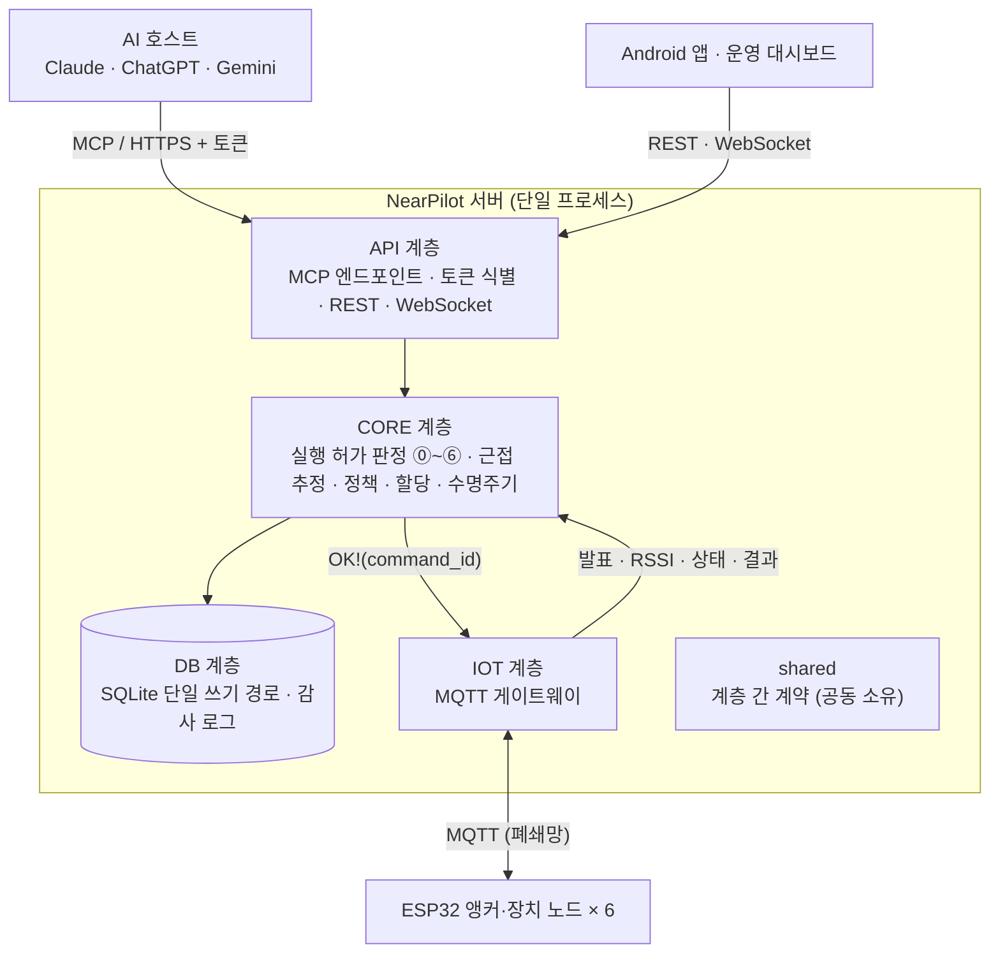
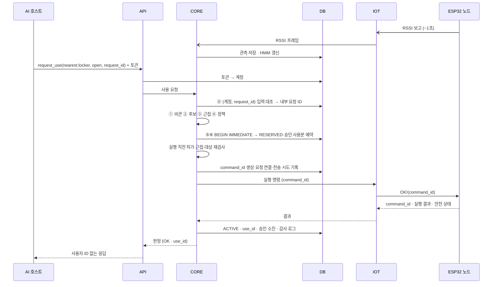
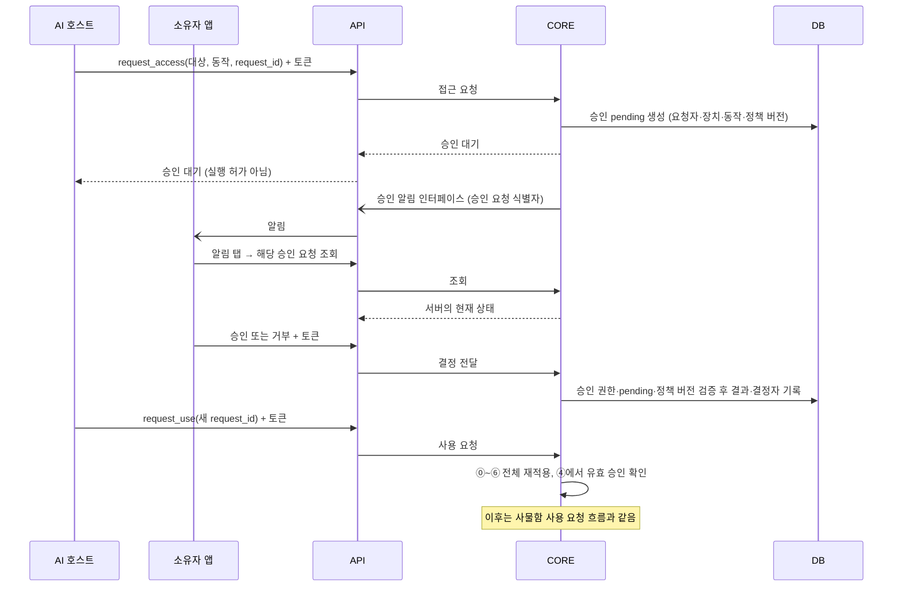

# NearPilot 서버 아키텍처

> 최상위 요구사항은 [PRD](./prd.md)를 따른다. 이 문서는 **서버 저장소의 구조와 4인 분담**을 정하는 하위 설계 문서다. 내용이 충돌하면 PRD를 우선하며, 구현 세부사항과 제안은 이 문서에서 관리한다.

## 1. 4계층 구조와 역할 분담

서버는 API · CORE · DB · IOT의 4계층으로 구성한다. 4인의 역할은
**판정 · 근접 추정 · 상태 관리 · DB**이며, 계층 구조와 사람의 역할 분담은 구분한다.



| 계층 | 책임 | 관련 요구사항 |
|---|---|---|
| **API** | MCP Streamable HTTP 엔드포인트와 도구 6개, 토큰으로 계정 식별, 앱·대시보드용 REST, 실시간 모니터링 WebSocket, 소유자 앱 승인 알림 전달, 응답에서 사용자 ID 제거 | FR-08·09·10·11, FR-01·03·12A·12B(서버 측), NFR-01·07·08·09·11 |
| **CORE** | ⓪~⑥ 결정론적 판정, 실행 직전 재검사, 근접 추정(관측 모델 + HMM), 재질문, 접근 정책·승인, 전역 할당, 상태 머신·해제·FAULT 복구 | FR-13~21·23, NFR-02·04·05·06 |
| **DB** | SQLite 스키마, 단일 쓰기 경로와 `BEGIN IMMEDIATE` 원자적 점유, 저장소 조회, 감사 로그(테이블 + JSONL), 공개용 데이터셋 추출 | FR-19(원자성)·22, NFR-03·13, PRD 데이터·기록 요구사항 |
| **IOT** | MQTT 브로커 연결, 노드 발견·RSSI·상태·실행 결과 수신과 검증, 실행 명령 전송과 결과 대기(타임아웃), 노드별 자격정보, 노드 시뮬레이터 | FR-04~07(서버 측), NFR-08·10·12, 지표 8 수집 |
| **shared** | 계층 사이에서 오가는 데이터 모델·열거형·인터페이스 정의. 4인 공동 소유 | PRD 판정·점유·외부 계약 |

| 역할 | 담당 코드·테스트 | 주요 책임 |
|---|---|---|
| **판정** | `src/nearpilot/core/decision/`, `tests/core/decision/` | 판정 ⓪~⑥ 조합, 근접·정책·점유 결과 반영, 실행 직전 재검사 |
| **근접 추정** | `src/nearpilot/core/proximity/`, `tests/core/proximity/` | 관측 모델·HMM, 사후확률 계산, 근접 추정 인터페이스 |
| **상태 관리** | `src/nearpilot/core/lifecycle/`, `tests/core/lifecycle/` | 예약 이후 상태 전이, 이탈 유예·타임아웃·해제·FAULT 복구 |
| **DB** | `src/nearpilot/db/`, `tests/db/`, `tools/evaluation/` | 스키마·저장소·원자적 점유 및 승인 사용분 처리·감사 로그·평가 스크립트 |

이 표는 역할별 담당 범위를 기록하며 개인 이름은 명시하지 않는다. `api/`, `iot/`, `core/policy/`,
`core/allocation/`과 노드 시뮬레이터·수집 도구의 세부 담당은 별도로 합의한다. 해당 영역은 작업 전에
4인이 담당 범위를 조율하며, API·IOT 전담자가 이미 정해졌다고 가정하지 않는다.

## 2. 폴더 구조

```
.
├── docs/
│   ├── prd.md                       최상위 요구사항 · 범위 · 인수 기준
│   └── architecture.md              PRD를 구현하는 구조와 계약 (이 문서)
├── src/nearpilot/
│   ├── shared/            [공동]  계층 간 계약: 도메인 모델 · 열거형 · 인터페이스
│   ├── api/               [세부 담당 미정]
│   │   ├── mcp/           MCP 엔드포인트 · 도구 6개 (FR-08~11)
│   │   ├── auth/          토큰 → 계정 식별, 무효 토큰 거부
│   │   ├── rest/          앱(계정·승인) · 대시보드(신뢰·정책·복구) API
│   │   └── ws/            실시간 모니터링 (FR-12B)
│   ├── core/              [역할별 하위 폴더 담당]
│   │   ├── decision/      [판정] ⓪~⑥ 판정 파이프라인 (FR-15·18)
│   │   ├── proximity/     [근접 추정] 관측 모델 · HMM · 재질문 임계값 (FR-16·17)
│   │   ├── policy/        [세부 담당 미정] 접근 정책 · 승인 검사 (FR-14)
│   │   ├── allocation/    [세부 담당 미정] 전역 할당 (FR-23)
│   │   └── lifecycle/     [상태 관리] 상태 머신 · 자동 해제 · FAULT 복구 (FR-19·20, NFR-04)
│   ├── db/                [DB]
│   │   ├── schema/        DDL · 마이그레이션
│   │   ├── repositories/  테이블별 저장소 · 원자적 점유
│   │   └── audit/         감사 로그 (FR-22)
│   └── iot/               [세부 담당 미정]
│       ├── mqtt/          브로커 연결 · 구독 · 명령 전송
│       └── messages/      MQTT 페이로드 스키마 (펌웨어와의 계약)
├── tests/
│   ├── api/  core/  db/  iot/     계층별 단위 테스트 — 역할별 담당 범위와 대응
│   └── integration/               계층을 합친 시나리오 테스트 — 공동
└── tools/
    ├── node_sim/          가상 ESP32 노드 (하드웨어 없이 개발·부하 시험) — 세부 담당 미정
    ├── data_collection/   RSSI 라벨 수집 (지표 8) — 세부 담당 미정
    └── evaluation/        지표 1~9 평가 표·그래프 생성 (NFR-13) — DB
```

각 담당자는 §1의 자기 담당 코드와 대응하는 테스트 범위 안에서 작업한다.
`core/`는 판정·근접 추정·상태 관리 담당이 하위 폴더별로 나누어 사용한다.
다른 담당 범위를 고쳐야 하면 해당 담당자와 먼저 조율한다. 세부 담당이 미정인 영역은
4인이 담당 범위를 합의한 뒤 작업한다. `shared/`와 `tests/integration/`은 4인 공동 소유다.

## 3. 의존 규칙

```
api  ──▶  core  ──▶  db
            │  ◀──  iot      (iot → core 는 이벤트 전달, core → iot 는 실행 명령)
모든 계층 ──▶ shared
```

1. **api는 db를 직접 부르지 않는다.** 예외는 토큰 → 계정 식별 하나뿐이다.
2. **core만 판정한다.** api와 iot는 판정 결과를 전달할 뿐 허가 여부를 바꾸지 않는다 (NFR-07).
3. **iot는 core가 보낸 OK 없이는 노드에 실행 명령을 보내지 않는다** (FR-06).
4. **계층끼리는 서로의 구현이 아니라 `shared`에 정의한 인터페이스에만 의존한다.** 그래서 각자 가짜 구현(fake)으로 다른 계층 없이 개발·테스트할 수 있다.
5. **db의 쓰기는 한 경로로만 한다.** 대여형의 ⑤⑥ 검사·RESERVED 생성·승인 사용분 예약은 `BEGIN IMMEDIATE` 트랜잭션 하나에서 처리한다 (FR-19, NFR-03). 공용 조명도 승인 사용분을 원자적으로 확보하지만 점유 세션과 CLOSING은 사용하지 않는다.

## 4. 계층 간 계약 (shared)

`shared`에 둘 인터페이스 목록이다. 구현 전 첫 주에 4인이 함께 확정하고, 이후 변경은 4인 리뷰를 거친다.

| 인터페이스 | 제공 | 사용 | 내용 |
|---|---|---|---|
| 저장소 인터페이스 | DB | CORE (API는 계정 식별만) | 계정·비콘, 노드, 정책 이력·승인 사용분, 외부 키와 내부 요청/명령 연결, 점유 세션, RSSI 관측, 원자적 점유·승인 예약(`reserve_if_free`) |
| 감사 로그 인터페이스 | DB | CORE | 단계별 입력·결과·버전·임계값·후보 확률 기록 |
| 노드 명령 인터페이스 | IOT | CORE | `command_id`별 전송·결과 추적. 확실한 미전송, 전송 후 성공/실패, 결과 불명을 구분. 시간 초과·연결 끊김을 미실행으로 간주하지 않음 |
| 노드 이벤트 인터페이스 | CORE | IOT | 기능 발표, RSSI 프레임, 안전 상태 보고를 전달받음 |
| 기능 인터페이스 | CORE | API | MCP 도구 6개와 관리 기능(계정 등록, 노드 신뢰, 정책, 승인, FAULT 복구) |
| 승인 알림 인터페이스 | API | CORE | 승인 대기 생성 시 소유자 앱 알림 요청(승인 요청 식별자 전달). 전달 수단은 PRD §7 미결. 전달 실패는 승인 상태·판정을 바꾸지 않음 |
| 도메인 모델·열거형 | 공동 | 전체 | PRD에 정의한 상태값, 판정 결과(OK·BUSY·ASK·DENY·NEED_APPROVAL), 사유 코드, 요청·판정·세션 값 객체 |

판정 결과를 호스트에 돌려줄 때는 사용자 ID와 점유 주체를 빼는 변환을 반드시 거친다 (FR-11, NFR-08).

CORE는 명령 미전송이 확실한 취소에만 예약·승인 사용분을 자동 반환한다. 전송 시도 후 결과 불명은 점유·승인 보류 및 FAULT로 처리하고, IOT는 새 명령 ID로 자동 재시도하지 않는다. 자기 요청의 예약은 실행 직전 재검사에서 경합으로 판정하지 않는다. 공용 조명 자동 꺼짐은 초기 비활성이다.

## 5. 사물함 사용 요청의 계층 간 흐름

정상 경로다. 실행 직전 재검사 실패와 실행 결과 불명 시 처리는 PRD §4를 따른다.



### 접근 승인과 사용 재요청

토큰 → 계정 식별은 생략했다. 알림 전달 수단은 PRD §7 미결이다.



## 6. 외부 인터페이스 (초안)

도구 이름·멱등 키·명령 ID·권한 규칙은 PRD에 따라 확정했다. 토픽별 상세 페이로드와 REST 경로는 담당자가 구체화한다.

### MCP 도구 (API) — FR-09

| 도구 | 기능 | 비고 |
|---|---|---|
| `find_available_devices` | 주변 장치 조회 | 조작 가능/승인 필요로 구분, 비콘 미수신이면 빈 목록 |
| `get_device_state` | 장치 상태 조회 | 근접 검사 없음. 비공개는 소유자/현재 본인 세션 권한 확인, 점유 주체 비노출 |
| `request_access` | 제한 장치 접근 요청 | 승인 후 사용 재요청 |
| `request_use` | 사용 요청·실행 허가 | 외부 멱등 키 `(계정, request_id)`. `nearest:locker`·`locker-1`·`any:locker` 지원 |
| `release_use` | 사용 종료·해제 | 본인의 유효한 사용 권한 확인 |
| `get_use_status` | 사용 상태·종료 이력 조회 | 근접 검사 없음, 본인만. 만료 후에도 이력 보존기간 내 조회 (FR-21) |

### MQTT 토픽 (IOT) — 펌웨어와 공유

| 토픽 | 방향 | 용도 |
|---|---|---|
| `nearpilot/node/{node_id}/announce` | 노드 → 서버 | 기능 발표 (FR-04), retained |
| `nearpilot/node/{node_id}/rssi` | 노드 → 서버 | 약 1초 스캔 결과 (FR-05) |
| `nearpilot/node/{node_id}/status` | 노드 → 서버 | 하트비트 · 안전 상태 (FR-07) |
| `nearpilot/node/{node_id}/result` | 노드 → 서버 | `command_id`에 대응하는 실행 결과 (FR-07) |
| `nearpilot/node/{node_id}/cmd` | 서버 → 노드 | `OK!(command_id)` 실행 명령 (FR-06) |

노드는 `command_id`별 접수·처리·결과 기록을 재시작 후에도 보존한다. 동일 ID는 재실행하지 않고 저장된 진행/결과를 반환한다. 물리 동작과 기록 사이의 장애로 결과가 불명확하면 추정 성공·자동 재실행 대신 복구 절차로 넘긴다. 기록 보존기간과 오래된 명령 거부 방식은 PRD §7에서 구체화한다.

### REST · WebSocket (API)

| 그룹 | 사용처 | 요구사항 |
|---|---|---|
| 계정 | 앱: 계정·비콘 등록, MCP 연결용 토큰 발급 | FR-01 |
| 승인 | 앱: 대기 중 승인 목록, 알림 탭 시 해당 승인 요청 단건 조회, 승인·거부 전달(권한·상태·정책 버전 검증은 CORE) | FR-03·14 |
| 관리 | 대시보드: 노드 목록·신뢰·장소 배치·정책·FAULT 복구 | FR-12A |
| 모니터링 (WebSocket) | 대시보드: 판정·사후확률·상태 머신·감사 로그 스트림 | FR-12B |

## 7. 기술 스택 (제안)

PRD가 정한 것은 SQLite, MQTT, MCP Streamable HTTP, WebSocket, HTTPS REST, pytest다. 나머지는 제안이며 첫 주에 확정한다.

| 항목 | 제안 | 이유 |
|---|---|---|
| 언어 | Python 3.12+ | pytest 회귀(NFR-13), numpy·scipy로 HMM·할당 구현 |
| MCP | 공식 `mcp` Python SDK 2.x | 2.x부터 `FastMCP`가 `MCPServer`로 이름이 바뀌었으니 1.x 예제를 그대로 쓰지 않는다 |
| HTTP | FastAPI + uvicorn | MCP 앱을 같은 프로세스에 마운트 (FR-08) |
| MQTT 클라이언트 | paho-mqtt | Windows 시연 노트북에서도 스레드 기반으로 동작 |
| 브로커 | Mosquitto (독립 AP 내부) | NFR-12 |
| DB | SQLite (WAL) | FR-19 |

## 8. 협업 규칙

1. 브랜치는 `feat|fix|intent/{계층}-{요약}`, 문서는 `docs/{요약}`으로 딴다. 계층은 `api`·`core`·`db`·`iot`·`shared`, 요약은 영문 소문자·숫자·하이픈이다 (예: `feat/core-atomic-reserve`, `docs/pr-template`). intent PR은 `docs/intent/{계층}-{요약}.md` 하나만 담는다. PR 제목은 `타입(계층): 요약`이며 계층은 생략할 수 있다. 형식은 CI(`.github/workflows/pr-rules.yml`)가 검사한다.
2. `docs/prd.md`·`docs/architecture.md`·`docs/intent/` 수정은 작성자 포함 3인(작성자 외 2인 승인)이 리뷰한다. `shared` 변경은 4인 모두 리뷰한다. 역할별 담당 범위의 코드·테스트 변경은 해당 담당자 리뷰로 충분하다. 규칙 원문은 `docs/intent/templates/intent.md` 헤더 주석이다.
3. 커밋·PR·테스트 이름에 요구사항 ID를 적는다 (예: `FR-19 원자적 점유`).
4. 각 FR마다 pytest 케이스를 하나 이상 두고, 정량 평가는 PRD의 인수 기준을 따른다.
5. 계층을 합친 시나리오(대표 시연 4장면)는 `tests/integration/`에 공동으로 작성한다.

## 9. 데이터 계약 (DB · shared)

PRD §3~5를 구현하는 논리 엔터티다. 필드의 세부 타입·인덱스·마이그레이션은 DB 계층에서 정의하되 아래 관계와 기록 정보는 보존한다. 외부 `request_id`는 계정 범위의 멱등 키이고, 요청 FK는 전역 고유 `internal_request_id`를 사용한다. 테이블 수는 고정하지 않는다.

| 엔터티 | 주요 필드·관계·제약 |
|---|---|
| `user` | PK `user_id`, `name`, UNIQUE `token_hash`, `role` (`visitor/owner`) |
| `beacon` | PK `beacon_id`, FK `user_id`, `uuid/major/minor` 조합 UNIQUE, `is_active` |
| `place` | PK `place_id`, FK `owner_user_id`, `name` |
| `node` | TEXT PK `node_id`, FK `place_id`, `capability`, `occupancy`, `trust_state`, `device_state`, `exclusive_group`, JSON `release_policy/anchor_params`, `last_seen_at` |
| `access_policy` | PK `policy_id`, UNIQUE FK `node_id`(노드당 하나), `current_version`. 현재 접근 정책 리비전을 참조 |
| `policy_revision` | 복합 PK `(policy_id, version)`, `visibility` (`public/private`), `mode` (`open/restricted`), FK `approver_user_id`, `approval_ttl_sec`, `approval_mode` (`one_time/time_window`), `max_uses`(기간형 무제한이면 NULL). 과거 리비전은 변경하지 않음 |
| `approval` | PK `approval_id`, FK `node_id/requester_user_id/internal_request_id/approved_by_user_id`, `action`, 정책 리비전 참조, `status` (`pending/approved/denied`), `valid_until`, `used_count`. 요청 참조는 승인 신청의 출처이며 허용 범위는 요청자·장치·동작·정책 버전으로 검사 |
| `approval_usage` | PK `usage_id`, FK `approval_id/internal_request_id`, 명령 연결, `state` (`reserved/held/consumed/released`). 요청별 중복 예약 방지. 예약·보류·소진을 합쳐 허용 횟수 검사하며 `used_count`는 소진 집계값으로 중복 계산하지 않음. 미전송 확정 때 자동 반환, 결과 불명은 복구 후 정산 |
| `rssi_observation` | PK `obs_id`, FK `node_id/beacon_id`, `rssi`(dBm), `frame_ts`(약 1초 프레임), nullable `label`(장치 1~6 앞/none) |
| `request` | TEXT PK `internal_request_id`, FK `user_id`, 외부 `request_id`, UNIQUE `(user_id, request_id)`, 정규화 입력 요약, nullable FK `parent_internal_request_id/node_id`, `target_spec/action/verdict/reason_code`, `p_max`, 버전 `model/calib/policy_ver/config_ver`, 실제 설정을 포함한 JSON `decision_context`, `host_kind` |
| `node_command` | TEXT PK `command_id`, FK `internal_request_id/node_id`, 대상 동작·입력 요약, 전송 시도·실행 상태·결과·시각. 승인 사용분과 연결. 결과 불명은 실패/미전송과 구분하고 기록을 재시작 후에도 보존 |
| `use_session` | TEXT PK `use_id`, FK `internal_request_id/user_id/node_id`, `state` (`RESERVED/ACTIVE/CLOSING/CLOSED`), `end_reason` (`release/leave/timeout/fault`), `expires_at`, 생성 당시 종료 정책. 대여형 요청과 세션은 1:0..1 관계 |
| `audit_log` | PK `log_id`, UNIQUE `event_id`, nullable FK `internal_request_id`, nullable 명령 참조, `step` (`auth/⓪~⑥/exec/close/fault`), JSON `payload_json`. 인증 실패는 요청 참조 없이 기록 |

- 계정은 여러 비콘·장소·요청을, 장소는 여러 노드를 가진다. 노드·비콘별 관측을 요청의 `decision_context`에서 재현 가능한 관측 구간으로 연결한다.
- `anchor_params`는 경로손실 파라미터 `A, n, σ`를 보존한다. `decision_context`와 감사 payload는 임계값·후보별 확률·관측 참조 및 모델·보정·정책 버전을 포함한다.
- 노드 기능은 `locker/light`, 점유 방식은 `rental/shared`, 신뢰는 `discovered/trusted/revoked`다. `ONLINE/OFFLINE`은 `last_seen_at`과 TTL에서 계산하며 신뢰 상태와 분리한다. `gate/pass`는 향후 확장 예약값이다.
- 장치 상태(`AVAILABLE/RESERVED/ACTIVE/CLOSING/FAULT`)와 세션 상태를 구분한다. FAULT는 장치의 격리 상태이며 불명확한 점유 세션을 삭제하거나 자동 종료하는 근거가 아니다.
- `release_policy`는 종료 조건·이탈 동작·미수신/유예 시간을 담는다. 유예 중 유효 비콘 재수신은 타이머를 초기화하고 CLOSING 진입 후에는 종료를 계속한다. 복구 시 실행 여부·승인 사용분·세션 상태를 함께 정산한 뒤 재사용을 허가한다.
- 운영 수치는 PRD §2의 초기 기본값과 설정 버전을 사용한다. `shared`에 단위·범위를 검증하는 설정 모델을 두고, 요청에는 적용 값·버전, 승인·세션에는 생성 당시 만료 및 종료 정책을 보존한다. 저장 필드와 스키마는 구현 시 구체화한다.
- 내부 요청을 생성하거나 기존 요청에 연결한 뒤 단계 로그를 쓴다. 같은 외부 키의 다른 입력은 기존 요청을 덮어쓰지 않고 충돌 이벤트를 남긴다. 정책 리비전과 운영 설정 버전은 독립적으로 관리한다.
- 전역 할당은 최대 배정 수를 먼저 구한 뒤 최소 비용·ID순으로 결정하며, 근접 기준은 완화하지 않는다.
